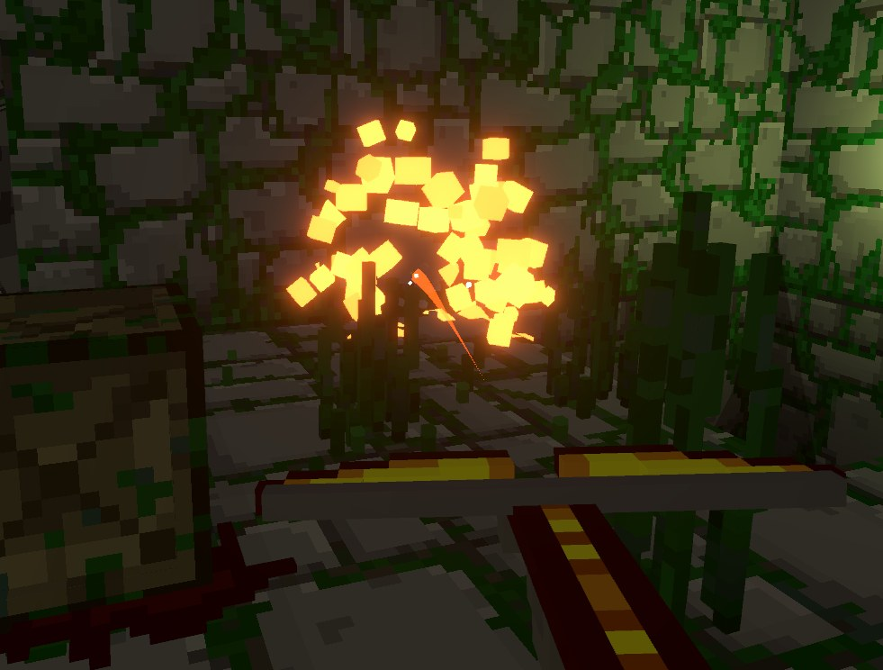
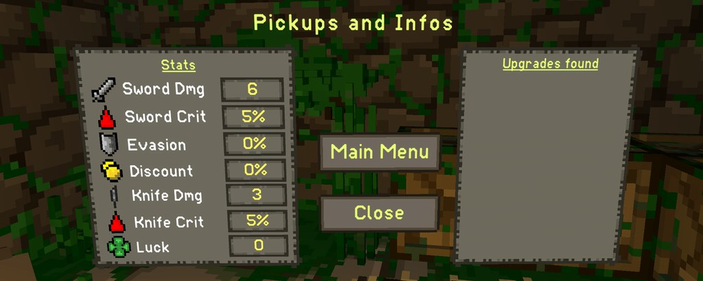

Hey everyone, this is the second bi-weekly development update, where we go over what we are currently working on and what is planned for the future.

## Release date of Sealed Souls Update

We currently do not have a release date for the Sealed Souls content update, but we plan on finishing up most of the required content for it next friday (Dec 10). After that, we will do some final testing and tweaking. Depending on how well this goes, you can expect to download the update in roughly two weeks from now.

## New content coming with the Update

Spoilers ahead!

## Searching for fallen adventurers

The main focus of this content update will be the challenge runs (for more information check Devlog #1). All challenge runs need to be unlocked, which can be done by finding the corpse of a dead adventurer in the dungeon and fighting their restless souls. Defeating them will give the player a journal page with more background lore about the fallen adventurer as well as a challenge run unlock.

## Crossbow enhancements

The crossbows colors and bolt will now also be affected by item pickups (same as the sword). We also added color changes to more items in order to make your weapon look more distinct depending on which upgrades you have picked up.

## New Stat

We are currently experimenting with an additional stat for the game: The Luck stat. This stat will not have too much importance for now and will just give the player a slight advantage or disadvantage depending on the situation. The Luck stat affects Gambling Machine outcome, some chances of items doing their effects (forge embers, punctured breastplate etc.), sacrifice statue outcomes and more. Luck can be increased/descreased by items or player actions (destroying a sacrifice statue decreases luck, winning multiple times at a slot machine increases luck, etc.). A negative luck stat can reduce the probability of certain items such as food etc, so taking an item or doing an action that reduces luck for some other gain will create interesting risk/reward gameplay. 

We definitely don't want to add too much RNG with this addition, so we plan on keeping most of the luck based things pretty minimal for the time being. For example, a maximum luck stat (100) will trigger punctured breast plate 20% of the time, a default luck stat (0) will trigger it 10% of the time, and a minimum luck stat (-100) will trigger it 0% of the time. Getting these extremely high or low stats is pretty rare (same as high evasion for example), so they should not be the norm.

## More balancing

We are still working on balancing some items and synergies and furthermore try to improve the general gameplay loop. Some people have voiced concerns over the game being too RNG heavy in some parts, so we are experimenting a bit with making some aspects of the game more consistent. One example would be the addition of shopkeepers having a higher likelihood of offering food when the player is at low health. Especially with the introduction of the Luck stat we need to be aware of not making the game suddenly too difficult or easy. We are listening to all your feedback and will keep improving the experience! 

## Miscellaneous

Apart from all of the above mentoined new features we have also been working on:

- ~15 new items
- 3 new orbs
- ~10 new milestones
- new journal pages
- tons of modding improvements such as better error handling which helps modders identify issues a lot easier than before, new events, better workflow for custom data handling and more. We will soon start improving the wiki and start adding better modding tutorials so people can get started more easily. We will also look into Steam Workshop support very soon

## Thank you!

Thank you everyone for supporting ADVR during it's early access phase! We have a lot of stuff planned for the future and can't wait to share it with all of you!
