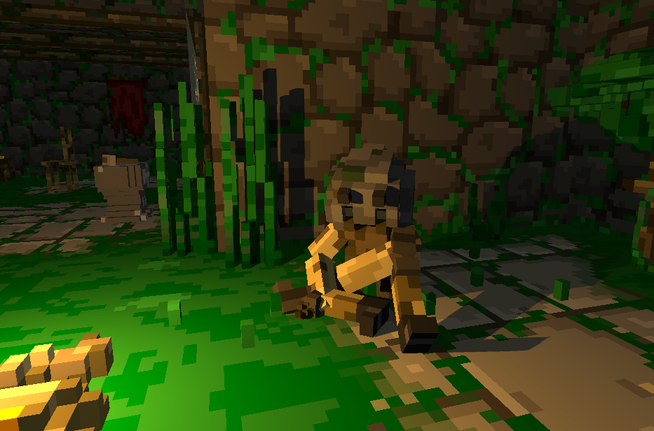
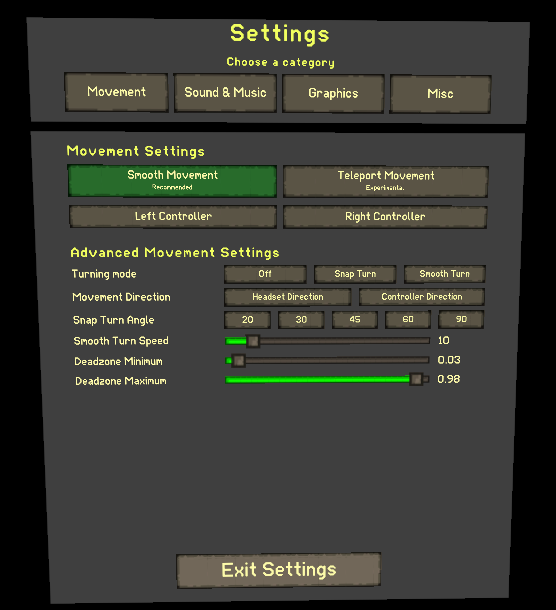

Hello everyone, this is the 6th development update. We are still working on porting over to OpenXR and we are making good progress. Here's a quick rundown of what happened over the last two weeks.

## Graphics improvements for PCVR

We decided to upgrade our Unity Version once again to 2021.2 in order to have access to realtime point light shadows. Since realtime shadows are pretty performance intensive, this feature will most likely only be available on PCVR and not on the Quest version (further testing needed). Here are a few screenshots to show the difference:

## A reworked settings menu

We have reworked the look of the settings menu to make it more easy to navigate, by splitting settings up into multiple categories. With the addition of shadows, we will also now have graphics settings for the game.

## Reworked weapon system

We have reworked the weapon system to be more generalized and moddable, which means custom weapons can be modded in in the next update. We are also starting on prototying a third weapon combo in the near future.

## Boring porting stuff

Most of the work the last two weeks has been spent on getting back to base functionality with OpenXR. This means, being able to climb, pick up objects, adjusting hand rotations, supporting different controller layouts and more. This process will probably still take until the next devlog in two weeks, but we are almost finished with it.
We also had to update multiple shaders that did not work anymore with the new Single Pass Instanced rendering mode.

All in all, we are making good progress with the rework, and once we have something stable, we will start testing it with our testers in order to ensure the switch will go over smoothly.
