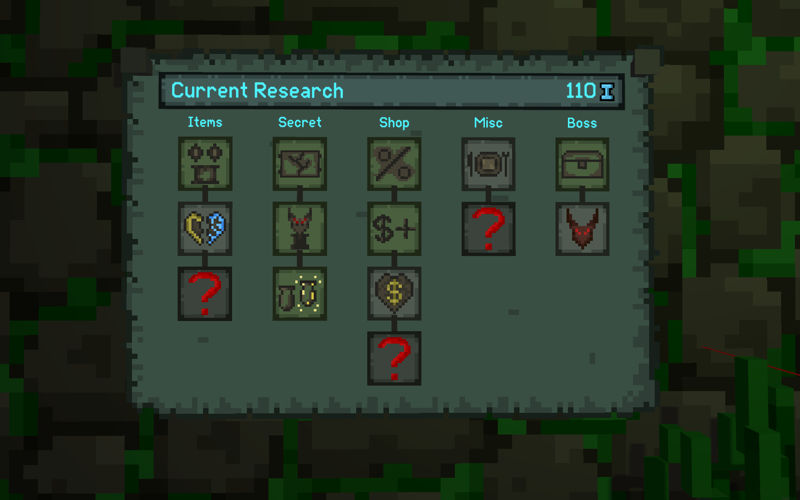
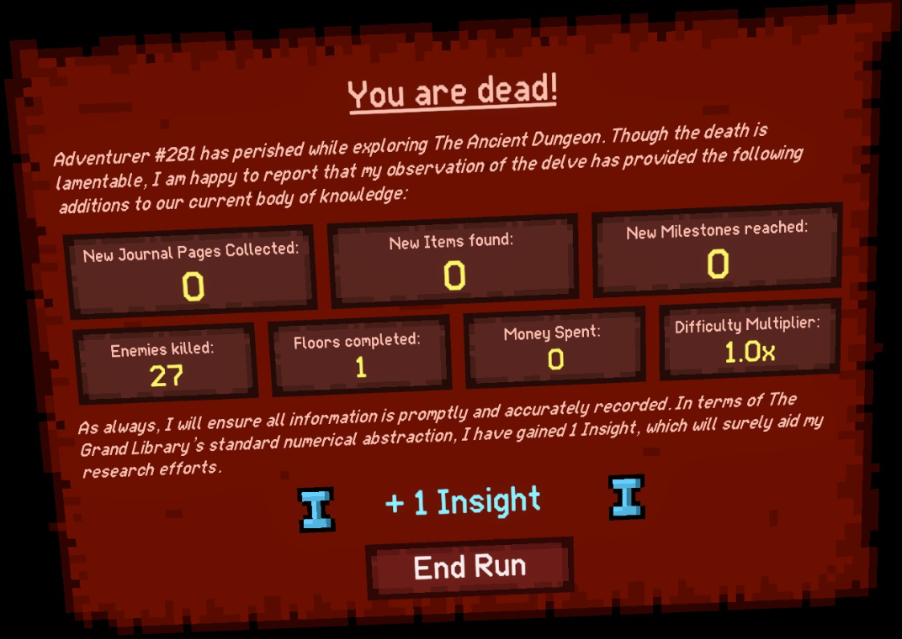

Hello everyone and welcome to the 7th development update. We are still working on porting over to OpenXR, but we are close to having back most of the functionality of the non OpenXR version. We have also taken some time to add a few new features. 

## Redesigned Insight Board

We have spent some time on adding a few new insight upgrades for next update. We also have reworked the look of the insight board, which now groups all the insight upgrades into a few categories which can be unlocked like tiny skill trees. The new board design also gives us more room to add more insight upgrades in the future without having a huge list of upgrades like in the old board.

## More ways to earn insight

With the rework of the Insight board we have also looked at how we can make players earn more Insight than there currently is. We decided to add more ways for players to earn Insight so more runs will get players towards their goal of buying the next upgrade. You can now earn Insight with:
- Collecting Items that have not been found before (amount depends on item tier)
- Completing milestones (amount depends on difficulty)
- Collecting journal pages
- Killing enemies (30 kills result in 1 Insight)
- Spending money in shops (50 coins result in 1 Insight)
- Completing floors (every floor grants 1 Insight)

We have also introduced a difficulty multiplier which multiplies your Insight if you play on hard mode to give you more incentive to play on a harder difficulty if you want to collect insight.

## Improved Hard Mode

We are currently also working on making hard mode more interesting. We are looking into spawning more enemies than in normal difficulty as well as a few other new mechanics to make it feel more distinct from the current normal difficulty.

## Physics Improvements

Many people have reported issues with the physics not working properly all the time. The issue can be seen best in the gif below. What happens is that the physics was not always properly synced up, which resulted in held weapons and objects not properly syncing up and sometimes skipping a frame.
We have now improved the consistency of the physics timestep which results in weapons properly attaching to the player hand without any delay.

## Consistent Seeds

Right now, if you enter a seed and play the game, the world generation will very quickly get non-deterministic and generate something entirely different than someone else who is playing the same seed. We have spent a lot of time getting the world generation to be consistent for a given seed. If you now share a seed with someone else, you can be sure to play a dungeon with the same layout, same items, and same enemies. Everything, even the slot machines outcomes in shops should be the same.
This change was needed for a few things: We can now more accurately respond to bug reports with the world generation because if someone now provides us with a seed, we can be sure to get the exact same world generation and fix bugs more easily. Secondly, these consistent seeds are needed for a feature way in the future: Daily Runs with leadersboards (more on that in a future devlog). Also, our speedrun community is looking forward to breaking the 5 minute barrier with a set seed run!

## WHEN IS IT COMING OUT?

Porting to OpenXR has taken way more time than we thought, but it was worth it. Now that almost everything is working again as it should be, we are close to launching the first experimental version so that the testers can start bug hunting. If everything goes well, the first experimental version will be out in a few weeks. However, I'm also on my first holidays since release in the second half of March, so there might be some delays with the experimental version. 
Thank you everyone for supporting this project, we are almost finished with the boring porting part, and can soon start creating new content!

You can also check our trello page to see our progress on the update in real time: https://trello.com/b/Zy8Xhc4G/ancient-dungeon-vr-progress
