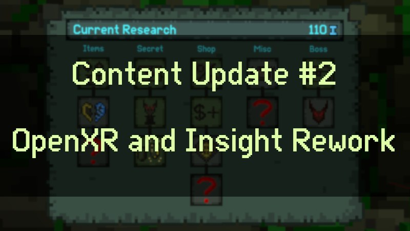

Ancient Dungeon ea0.1.2.0 has been released! The main part of this update was the time consuming port over to OpenXR as well as a huge code cleanup and rework to make many interactions less buggy and the gameplay more stable. PCVR players can look forward to playing with shadows to make the game look a lot more beautiful. The Insight system has also been reworked to lay the groundwork for more Insight related additions in the future. There have been tons of improvements under the hood, many of which can be checked out in more detail by looking at the previous devlogs!

The port over to OpenXR has been a challenging and time consuming task. We are pretty satisfied with how it turned out, however there can still be issues that our testers might not have spotted. So if you notice any issues (especially with more unknown or lesser used headsets) please let us know in the Steam discussions or our discord server. We will be closely monitoring this release to make the transition seamless for all players.

Now that the huge undertaking of porting the game over to OpenXR is done, we can 100% start focusing on new content. We have a lot of exciting stuff planned, and will post a new devlog soon!

<b>additions:</b>
- the Insight system has been reworked! Players now also collect additional Insight for spending money in shops, killing enemies, and completing floors. Hard mode also now gives a multiplier on collected additional insight. Collecting Journal Pages, Milestones and Items now gives more Insight than before. The amount of Insight depends on the difficulty of the milestone or the item tier.
- a rework of the Insight Board, which now has more Insight upgrades in different categories. To ensure a smooth transition to the new system, all your bought Insight upgrades will get refunded on update.
- PCVR now has point light shadow support and graphics settings (more settings to come in the future). Be aware, that shadows can cause a huge performance impact.
- picking up a mark pickup will drop an already equipped mark on the ground instead of voiding it
- 2 new Insight upgrades

<b>changes/fixes:</b>
- updated the Project to Unity 2021.3
- With the change to OpenXR a lot of interaction issues have been fixed because the whole movement, climbing and interaction system has been rewritten from scratch!
- The player stats have been reworked in a way that makes item combos more consistent in how they calculate damage (no matter the order in which they have been picked up)
- several items now have extra sound effects when they activate (Deafening Bell, Dented Gold Chime, Discarded Door Chime, Gaping Totem, Glowing Orange Spot, Needle of Oroborous, Packrat Mandible, Pit Friend, Silver Spoon, Swollen Dragon Lung, Tarnished Silver Chime, Tress of Silken Hair)
- lots of physics improvements: movement or weapon stutter should not occur anymore
- hard mode now spawns more enemies
- optimized several parts of the world generation algorithm to reduce the amount of lag spikes
- doors will not pop up anymore during generation when entering a next floor, the floor is already generated one the player gets there
- improved performance should result in a smoother framerate (especially on Quest)
- increased render resolution on Quest 2, which should result in a much sharper picture
- seeds are now completely consistent in the world generator
    - this includes podest rewards, slot machine outcomes, enemy drops, shop selection and more
    - be aware, that depending on your progress in the game, the same seed can still look different. For example, players that have secret rooms unlocked will have a different dungeon layout than players that don't have them unlocked yet
- improved the hold angle settings system
- your UI pointer can now be used on both hands
- cracked mirror now reduces your luck a lot more in exchange for better stats
- myopic lens has been reworked
- assassins mark now deals damage to bosses according to 25% of their max health
- befouling sludge now has a chance to deal crit damage
- enabling and disabling the ingame console without running a command will no longer block achievements for the run
- grinning totem now gives luck based on the amount of coins and keys that have been reduced
- Experimental versions now have a big warning in the main menu
- If a mod is broken, it will now show a big warning in the main menu
- fixed glittering orb and some items not working in hard mode
- fixed gaping totem not showing damage increase in stats when having coins
- fixed damage inconsistencies with NG+++
- reworked abacus bead
- fixed some items / progresses not having the correct behavior in NG+ and beyond
- fixed vial of blue blood + ruptured dog eye + glass cannon killing the player
- lobster bib now takes into account which type of food you are eating
- fixed shopkeeper boss hitboxes
- fixed challenge runs having hard difficulty when it was selected in the run preparation screen
- increased the length of the player sword and dagger by one voxel (to offset the more realistic holding position)
- increased bullet slime spit distance
- fixed hedges and potentially some other objects not getting cleaned up when the floor is completed
- better handling of pickups stacking their effects
- some visual improvements for the ingame console
- reworked the potion system which should fix most of the potion related bugs that have been reported
- fixed an issue in NG+++, which did not kill the player when DONT_SCALE_NEWGAME damage was applied (for example Packrat Mandible does this type of damage)
- reworked business senseless insight upgrade (now always gives an item, but only 1)
- Calcified Pustule now deals a small amount of extra damage instead of dealing less damage

<b>modding additions:</b>
- It is now possible to create custom weapons via modding (this feature is not fully developed yet, more improvements are coming in future updates)
- It is now possible to create overrides of items (the new weapon system already uses this to give items weapon specific changes)
- A mod settings menu where mods can create custom settings to toggle specific features of a mod on or off

<b>modding changes:</b>
- GetEnemiesInRadius and GetLivingInRadius have been changed to take a Vector3 instead of a Transform
- New Stat system TODO: write change tutorial
- renamed BlockChance to EvasionChance, renamed ShopPriceMultiplier to ShopDiscount (ShopDiscount now works the other way around compared to ShopPriceMultiplier)
- renamed SwordDamage to PrimaryDamage, renamed KnifeDamage to SecondaryDamage
- renamed SwordCritChance to PrimaryCritChance, renamed KnifeCritChance to SecondaryCritChance
- removed IncreaseEvasionByRule, because it is now automatically calculated via the Stat System
- droptable.AddToDroptable now also has hardmodeProbability as a parameter
- reworked the potion/orb system to take care of a lot of things automatically, like keeping track how often the player has been affected, which enemies have been affected and vignette effects. 
- ChangeRandomPlayerStatsSlightlyUnique and ChangeRandomPlayerStatsSlightly now take a key value as their first parameter because of the new stat system
- UpdateWeaponColors does no longer need an array of strings of which weapons need to be colored. Instead there now is UpdateWeaponColorsPrimary, UpdateWeaponColorsSecondary, UpdateWeaponColorsAll, UpdateWeaponColorsMelee, UpdateWeaponColorsRanged
    - SetTrailColor and SetTrailEmission have the same behavior now
- Exposed many new Types
- renamed AmountPickupFoundDuringIn to PickupFoundInRun
- renamed AmountTotalPickupsFoundDuringRun to TotalPickupsFoundInRun
