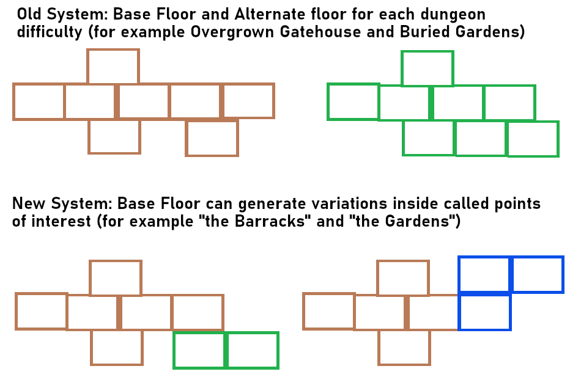

Hello everyone, welcome to the 10th development update. We finally have some news to share on what we are working on and what new content you can expect in the coming months.

## Small content update on September 15

Ancient Dungeon will release on the Quest Main Store on September 15, 10AM Pacific Time. Along with this release, there will be a small content update on both platforms as well as a rewrite and expansion of the games journal pages to make it align with our future planned content. First, all journal pages that had no real connection to other parts of the game ("The Thief", "The Innocent") will be replaced by journal pages relating to the sealed souls adventurers. Unlocking ghost fights will also change: You need to find all journal pages that belong to a certain soul in order to unlock its ghost fight. This will flesh out each of the soul delves and make the journal pages more connected to the rest of the game. 

There will also be entirely new journal pages concerning the **Main Story** of the game. When the player finished a run, new journal pages will appear which will further expand on the lore of the game and hint on future content.

All in all, there will be 24 new journal pages for you to find and read through. We have also added 6 new items for you to find in the dungeons.

## More future content

Since we did not have too much time adding content for the main store release update (QA deadlines, preparations for marketing, bugfixing on the OpenXR update, and lots of other behind the scenes work for the main store release), we will focus on a bigger content update as the update after the main store release update. In general there are 4 things we want to add very soon. Depending on the amount of time we need, we might split them up into 2 updates to reduce waiting time for you.

## Points of Interest system

This is probably going to be the biggest addition to the game and will make the dungeons a lot more varied and interesting. This system can be understood as a compromise between development time and dungeon variation. Initially, we wanted to have an alternate floor for each of the current floors (except The Cradle), with new enemies, new rooms and a new boss. These alternate floors would be the same difficulty wise as the original floors but appear randomly in order to make runs feel more unique. However, there are a few issues with this approach:

- Development time: Creating a new floor takes a lot of development time. Even if we can reuse some enemies from their original counterpart, creating a new floor will probably take around 2 months of dev time until they are fully functional, balanced and varied enough. Multiply this by 4 and we are looking at more than half a year of dev time just to create these new floors.
- They have the same difficulty: While the new enemies and variety definitely would be cool, the difficulty of the floors would be similar to the already existing ones. This means, the novelty of encountering an alternate floor would quickly wear off, because players that already manage to win runs consistently, would not have a lot of new challenges in the alternate floors.
- More dungeons result in less dungeon variation: The more dungeons we have to manage, the more time we need to improve them. Adding variation or a new enemy to 4 dungeons is a lot easier than doing the same for 8 dungeons. Right now, the current 4 dungeons we have still do not have enough rooms and mechanics to feel like a fresh experience for experienced players each run. We are planning on adding a lot more rooms and mechanics for the already existing dungeons, but the prospect of doubling our workload by adding alternate floors, does not seem like a good idea.

To summarize: Adding alternate floors seems like a cool idea to increase variation in the game, but ultimately would result in extremely long development times and even more managing overhead for us. We think this development time is better spent on increasing variation of the existing floors and working on an even more difficult floor after the Cradle (more on that in a future devlog). The solution we came up with is called the "Points of Interest System".

In general, this system will add more dungeon variation by adding themed room groups into a dungeon that can be randomly found (or with some prerequisites). If you still know the subareas from the beta version, points of interests will act like a subarea, but smaller. For example, the overgrown gatehouse can have a variation which is called "The Barracks". This variation will have a slightly different wall and ground texture, as well as wooden bunks scattered in the rooms. A new type of enemy can also be found there. It can randomly appear in the overgrown gatehouse and fill up 2-3 rooms maximum. This has multiple advantages over the other system:

- More variations possible: Since each variation is only 2-3 rooms big, we need to build a lot less rooms to make a varied point of interest. This means we can introduce a lot more variations with less development time for each dungeon.
- Increases variety of the existing dungeons: We have multiple points of interest planned for each dungeon, which means we automatically increase variety in all of them without creating new "base" rooms for the dungeons. We will still create new base rooms, but we need fewer of them, because we already increase variety with building points of interests.
- Unique challenges: Since these points of interests are often just a small part of the dungeon, we can introduce some unique designs or challenges into them. For example, we could create tall vertical rooms with unique climbing challenges and have them generate as the "Wailing Pits" point of interest. A whole floor made up of climbing puzzles would be too big and tiresome, but a small localized version of it that only spawns roughly every 10 runs could be a fun and interesting addition. There are a few other cool things we can do with this system, such as introducing harder variations in early floors for experienced players.
- More bosses: Since we do not need to create a new boss for each of the alternate floors, we can use that development time to create a new boss for each of the existing floors, increasing the amount of bosses to 2 per floor.

Here is a small graphic that tries to explain our new system:

Points of interest will not spawn on each floor in every run, but they will show up occasionally in order to make a run more varied. They will also be listed in the homebase world map panel so you can see which ones you have already encountered and which ones you have not. I hope this explanation makes sense, we are still in the planning stages so changes to this system are still very likely.

## New modifier system

We have removed the current modifier system, because it was pretty outdated and did not have a lot of actual interesting modifiers to offer. It also stopped game progression, which further discouraged players from using it. This is why we plan to rework the modifier system and make it more interesting. We will add new modifiers which change the way the game plays, and also add modifiers which need to be unlocked by completing soul delves. Each modifier will have a "difficulty multiplier" which is a value of how much harder the modifier makes the game. For example a modifier that increases the chance of enemies spawning as abberrants, has a difficulty multiplier of 1.2, meaning the player will get 20% more Insight when completing a run with the modifier active. Modifiers can be stacked, so players can turn the game a lot harder (or easier) if they want to and get rewarded accordingly.

## Improved modding tools

The modding tools (especially the room modder) have been neglected for some time now. With the upgrade to OpenXR and a new Unity version, the tools are in a very broken state (that's why there are currently no new rooms being added by us). Since we need these tools ourselves to create most of the rooms and items, we will rewrite them and provide new builds for you in the near future. We will also work on adding new modding tutorials to get more people into modding the game.

## Lots of QoL improvements

When looking at the trello page, there are a lot of QoL improvements that we want to do (Reset progress setting, multiple save slots, evasion sounds, better pointer angles, etc.). Some of these will make it into the next update, and some of them will still take some time to get implemented.

## Goodbye Thom!

Thom joined the ADVR development team roughly 9 months ago and has contributed a lot to the game (sealed souls runs, new items, helping with the OpenXR port, and much more). Thom has decided to leave the dev team to pursue other career paths and we thank him and wish him the best! He will still remain active on the discord though and stays part of the community.
