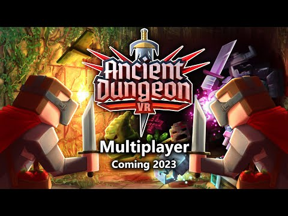

Hello everyone and welcome to the 10th development update. 

## Multiplayer

It's confirmed! Ancient Dungeon will get multiplayer next year. We do not have a release date yet because we still have a lot of work to do in the coming months to ensure that everything will run smoothly. We also still have a lot to plan out and test to make it work reliably. You can expect more detailed information on multiplayer in the next devlogs, but here are a few questions and answers for multiplayer:

- <b>Release date?</b> Not confirmed yet, hopefully sometime in Spring 2023, but this will most likely change!
- <b>How many players can play together?</b> The default mode will be 2 player coop but we also plan on supporting up to 4 players if we don't run into any issues with networking/data usage or performance requirements
- <b>How do people connect to each outher?</b> People can connect to each other in the homebase via a room code.
- <b>How are relics/coins/keys handled?</b> Our goal is to offer toggleable settings for a lot of things to enable players to play how they want with each other. For example, people can enable coin share (cash is shared between all players) or disable it (every player has the cash they collect). When a player picks up a relic, only that player will get the effect, but we will probably also offer settings to make it apply to all players. We are still in the planning stage for all of these settings so expect some more information on that soon.
- <b>What about dungeon difficulty?</b> We plan on adding difficulty scaling to the game in order to accomondate multiple players. This means increasing enemy HP, spawning more enemies, and making the dungeons bigger.
- <b>Friendly fire?</b> Currently not planned, but we might look into it if demand is there.
- <b>PVP?</b> Not planned
- <b>Will Multiplayer be crossplay?</b> Yes, crossplay is supported.
- <b>Do milestones/etc work in multiplayer?</b> Yes
- <b>Will mods work with multiplayer?</b> We can't guarantee that mods will work out of the box with multiplayer, but simple mods (for example adding new items) will most likely work without issues.
- <b>How will player deaths be handled?</b> We are still looking into it. We will most likely offer multiple options, such as reviving players with food, or losing the run when one player dies, etc.

## Release on other platforms

We are currently also working on releasing the game on other platforms. In a few days, Ancient Dungeon should be available on Pico 4 and Pico Neo 3. We are also working on releasing the game on another platform early next year (if everything goes according to plan).

## Other Content

Work has already started on the points of interest system. Since multiplayer has been in development simultaneously to the points of interest system, it remains to be seen which will be finished first. Our goal is to get multiplayer done as quickly as possible in order to have a reworked code base which we can then use to add new content. So expect points of interest to release after (or alongside) multiplayer.

We are also almost finished with an improved modding workflow, by releasing a language server for Visual Studio Code, which makes it possible for modders to get autocomplete information (with hints, documentation and more) for their items, achievements, etc. See the gif below:

Once that is release, we will also start producing some modding tutorial videos so everyone can get into modding a lot more easily than before.

Thank you everyone for all the support! I know the wait between updates takes a long time, but I assure you we are working as fast as possible to get all of this content out to you soon! The wait will be worth it.
