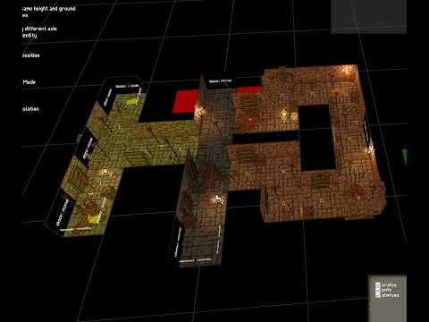

Hey everyone and welcome to the 14th development update. After a short christmas break we are back implementing the remaining features missing from the current multiplayer beta. We can also share a bit more of our planned roadmap for this year and show off some new stuff we have been working on alongside the multiplayer implementation.

## Multiplayer full release

We want to achieve feature parity between ea0.1.3.6 and the multiplayer beta very soon, so that we can finally merge the two game versions to continue working on new content. This will hopefully happen sometime in February. Until then, we will continue to fix bugs and add the missing features in regular updates.

Once multiplayer is out of beta we will start the porting process for PSVR2. Players on PSVR2 can expect multiplayer to come out roughly 1-2 months later than the other platforms (because of QA, new requirements etc). We will also simultaneously start working on new content updates.

## Towards more rooms and new content

While most of the content from ea0.1.3.6 and the multiplayer version is the same, there are still some small additions, balancing changes, and bug fixes. One big new feature however, is the introduction of a lot more rooms for more variety during gameplay. More rooms are needed, especially when playing with multiple people. The majority of the rooms currently in the game can feel cramped and unbalanced for higher player counts, which is why we want to create a big chunk of new rooms specifically targeted towards multiplayer gameplay. These rooms can still spawn in singleplayer to increase variety for solo players, although less frequently to keep the balance. 

In order to not get overwhelmed by all these new room requirements (which will only get bigger once points of interest come into the game) we reworked part of the room generation to now support subgroups. To keep it simple, subgroups are small parts of rooms that can take different shapes or forms in order to create possibly hundreds of variations of a single room within a few minutes. This is especially useful for corridors or more generic rooms, because we can quickly generate tons of different rooms out of a few singular parts. Below is a small video that shows one of these rooms and all the possible combinations that can generate because of it. Notice how the center corridor line always stays for each room. Later in the video it also shows each of the parts colorized so it is easier to see how each of the subgroups gets attached. This proof of concept room was built in 10 minutes and can have a total of 250 different combinations!

This addition to room generation will soon give the game hundreds of new rooms with a lot less time spent building them. Expect a lot of new rooms in the coming multiplayer beta updates once the subgroup feature is fully implemented.

## Our roadmap post multiplayer

As we stated in earlier devlogs, we would like to increase the rate of updates once multiplayer is out to keep a steady flow of new content and keep players engaged. This means once multiplayer is out, we will release smaller content updates in frequent intervals. We haven't decided yet how each update will look like but each update will add content from one of a few categories:

<b>Points of Interest</b>
Points of Interest is a huge category which will expand the game by a huge amount and will make it less linear and more interesting to explore. Points of interests will range from singular special/interesting rooms for each dungeon to possibly entirely new floors that are not part of the main path. Since this category is basically endless, there will be many updates adding content in this category.

<b>New Relics, Insight Upgrades, and Weapon Combos</b>
This category is pretty self explanatory. We want to add more relics to increase their variety, more insight upgrades to spend insight on and more weapon combos to make for a more varied playstyle between runs.

<b>Homebase Expansion</b>
We want to increase the size of the home base and add new NPCs and boards with new things to do. For example, we want to add a bestiary, a stat screen that tracks certain things you do in the dungeon, a cosmetics shop for multiplayer games where you can buy certain cosmetics (with in game currency, not in app purchases), and more.

<b>Modding Improvements</b>
We want to keep improving the modding implementation and streamline the modding experience to make it easier for everyone to create and manage mods

<b>Final floor</b>
As many of you know, the current final boss in the game is not the real final boss that will be in the full release. While this feature will most likely not be finished this year it is one too look forward to.

Future devlogs will go into more detail on our roadmap!
