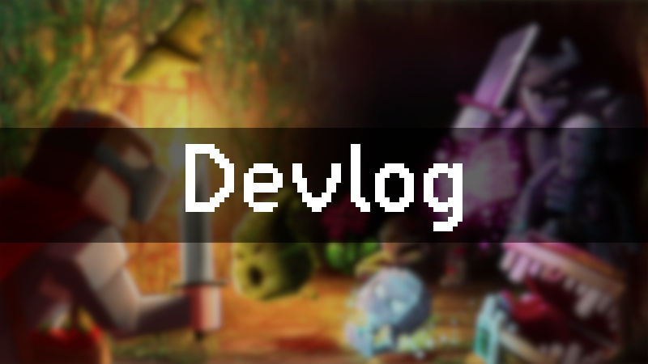
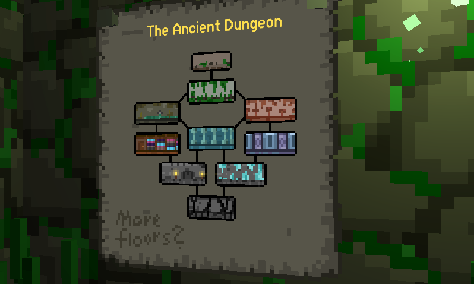
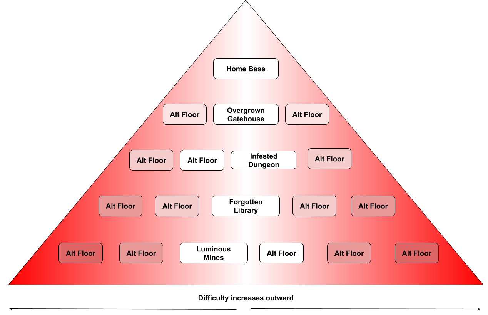
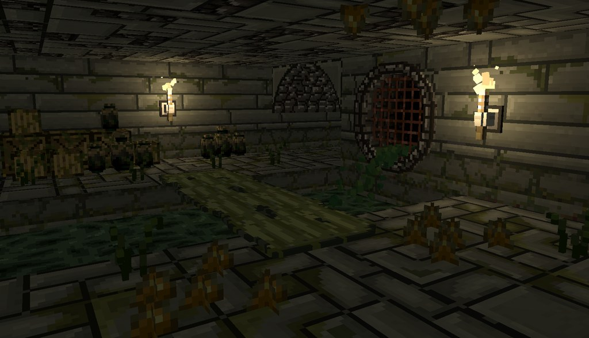
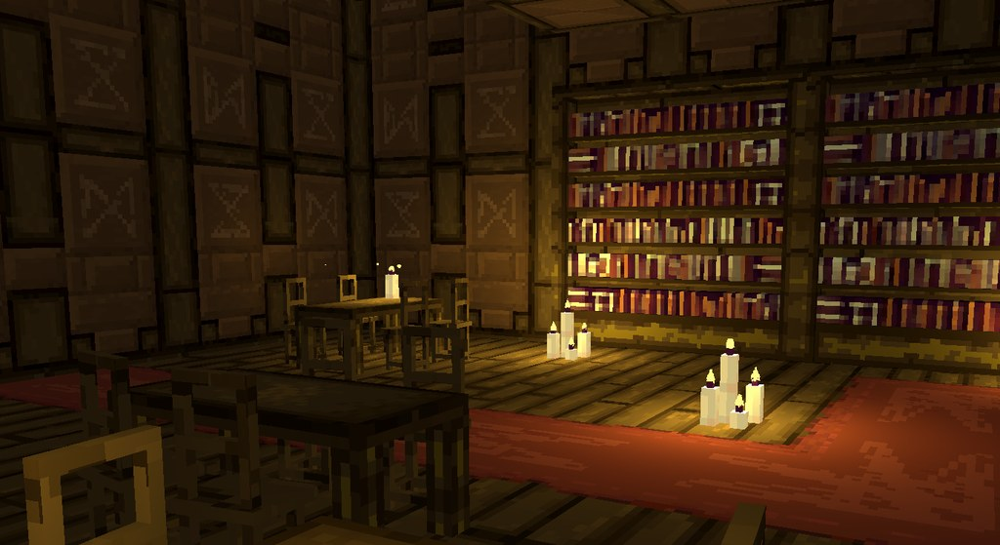
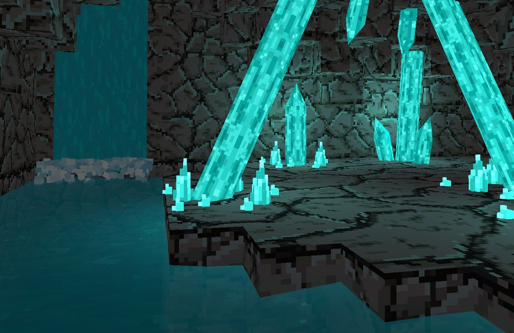

<b>Hey everyone, and welcome to our 16th development update, which will cover a lot!</b>

Since the launch of Ancient Dungeon, multiple content updates have been released including:

1. Seals Souls Update
2. Insight Rework
3. New Relics
4. Expanded on Lore

We’ve also spent significant development time building much requested features like multiplayer and porting the game to other platforms so others can enjoy Ancient Dungeon!

Here’s a recap of all the progress we’ve made so far:

<b>Update</b> | <b>Time Spent (Months)</b>
OpenXR Rework | 6
Multiplayer | 18
PSVR and Pico Porting | 3
Official Quest Store Release | 1
Sealed Souls Update (Challenge Runs) | 1
Insight Rework / New Pages | 1
Christmas Update (Hard Mode Modifiers) | 0.5
Total | 30.5

It's been a lot of time and a lot of work for our small dev team, but we're proud of what we've done. As you can see, we’ve spent a lot of time on the multiplayer update and OpenXR rework, which meant we didn’t have as much time to dedicate to new content. 

With this milestone completed we’re excited to be moving our focus back to new content for the game! Players can expect an explosion of fun updates in the coming months! What sort of fun, you ask? Let's take a look...

## The Road to 1.0

In the last few weeks, with your feedback and suggestions we have planned out a rough structure on what a proper 1.0 release looks like. While this roadmap might change (as most of our plans do) it gives a general overview of what you can expect from us in the coming months.

## Introduction of Alternate Floors - The Dungeon…is Growing?

Now If you’ve read our previous devlogs you know we talked about not introducing alternative floors, that was because of the time involved in creating them as well as them having the same difficulty as the base floor. The compromise we came up with was the<b> Points of Interest system (POI)</b>, in which floors could create small variations inside of them to make each floor more unique.

During testing and design, we realized that while the approach made sense on paper, it felt too restrictive in practice and was difficult to design because each POI is only allowed to have a small number of rooms. The dungeons still felt too similar. The definition of a POI was too broad, ranging from special rooms to entire clusters, making it hard to define clearly. Some POIs were just special rooms with the same textures, while others looked like entirely different floors. Ultimately, we were unsatisfied with the current POI system and decided to break it up.

<b>This is going to be done in two major ways:</b>

Firstly – Points of Interests are going to be added to the game in the form of single rooms or small multi room areas. Examples of this can look like:

- A special type of shop that can appear instead of a normal shop
- A climbing challenge or puzzle room
- Rooms with a new type of enemy, mini-boss fight, or an NPC encounter

Additionally, POIs will be like the dungeon they are in, meaning they are unique to the dungeon you are currently exploring and look different as you traverse through the floors.

Secondly, we are adding multiple alternate floors to the current floor architecture. Be warned, these alternate floors will not be the same difficulty as their base counterparts. As you adventure in these dangerous alternate floors, you will find them more challenging. Fear not the base path will remain unchanged (Overgrown -> Infested -> Library -> Mines) for those that dare not take on this challenge. However, should you choose it, the further you get away from the base timeline, the more difficult the floors will get.

In this sense, the dungeon will be laid out like a triangle, the deeper you travel the more possibilities you have to explore brand new dungeons.

<i>Please note, this visualization is subject to change and the number of floors have not been determined yet</i>

While this means big changes, some aspects of the adventure will remain the same:

- Most alternate floors will not feature their own special boss, they will most likely feature a boss from the base floor with a variation in the boss mechanic to make them more unique and challenging
- While most alternate floors will have some new enemies, you’ll still encounter the creatures you’ve come to learn and love
- Base floors will remain available, but alternate floors will need to be unlocked

Are you excited? Well get ready to be even more excited with some sneak peeks into these strange worlds you’ll soon be adventuring in!

## The End(ing) Is Nigh (SPOILERS)

As many veteran adventurers are now aware, a terrible Beast lies in the lowest depths of the dungeon, a creature that doesn’t seem very interested in dying regardless of how much it’s hacked apart. Why? How? All will be made clear…

In addition to the new alternate floors, another floor beyond The Beast’s Cradle will be added, but will only be accessible when certain criteria are met. There, the true source and full history of the Ancient Dungeon will finally be revealed.

## New Weapon, Who Dis?

Our beloved local blacksmith has been stirring his forge embers for awhile now, but finally seems ready to get to work! A new weapon combo is coming! What is it? Well, tune into future devlogs to find out…<i>(coquettish grin)</i>

## Putting The Multiplatform Into Multiplayer

As it turns out, implementing multiplayer on the Quest platform was a lot of time and work, but it’s finally (mostly) stable, which means it’s time to give our PSVR2 some multiplayer love. That sounded weird, but you understand. This porting will be done as we develop new content. Ideally, we want to achieve parity across all platforms. This takes significant development cycles, so we appreciate your patience as we get this out to our PlayStation adventurers. 

## New Team Addition

Some of you have already seen someone by the name of Rafi around. We are happy to announce, <b>Rafi will be officially joining the team!</b> Here’s a bit about Rafi:

Rafi was originally making ADVR mods like the mage class mod which helped him get into university for Animation. Grateful, Rafi wanted to give back and decided to join the team as our Level and Environment Artist. He is currently creating the visuals for the floors in the up-and-coming update. Please give a warm welcome to Rafi!

<b>What are you excited about the most? Don’t see a feature on here that you’d like, make sure to suggest what you want to see in Ancient Dungeon! 
</b>
