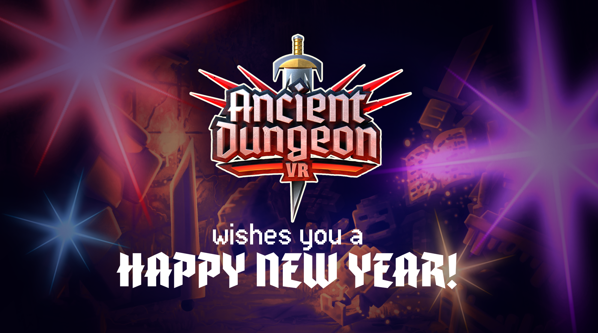

Welcome to the final post about 2024, adventurers!

Our team of dungeoneers have been hard at work this year, and we hope you’ve enjoyed the results of all that effort. In addition to putting the final touches on multiplayer, this year has given adventurers new floors to explore, new monsters to smash, and new relics to discover! Who could ask for more than that?

What? You could? Oh, okay…well, in that case…

EVERYTHING WILL BE MORE, AND BETTER, AND GREAT IN 2025!!1!!111!!

pant pant...I really shouldn’t yell like that, my doctor says it’s bad for my blood pressure…anyway…

Here’s the sitch for 2025, friendos: new weapons, weapon skins, cosmetics, more insight upgrades, more floors, more relics–and possibly other things we’ll think of later! The Ancient Dungeon is a wild place!

Now, in all seriousness: thanks to you all for playing and enjoying our game. We’ve been at this for awhile, and it is the unending enthusiasm and love our players provide that keeps us motivated, happy, and eager to work everyday. We still have a ways to go before we hit the big 1.0, but we can’t wait to be there with you all.

Happy New Year, happy this year, and happy every year after!

