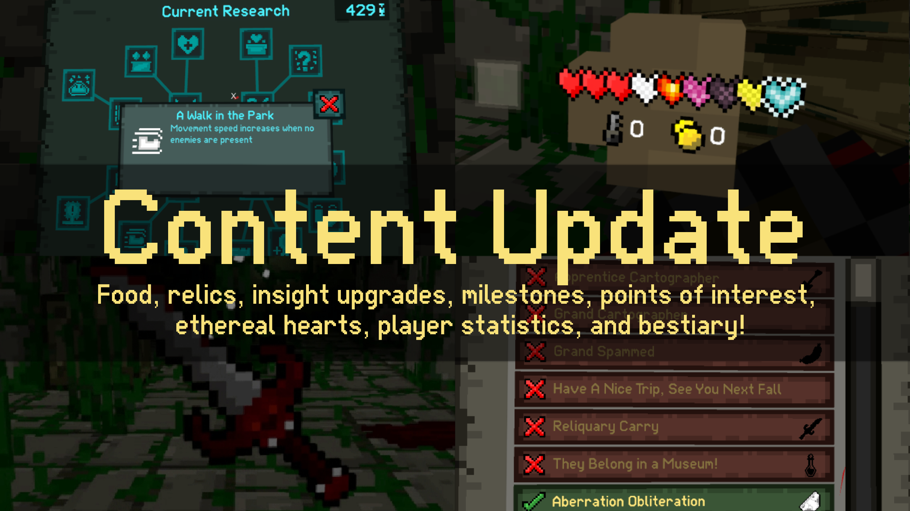
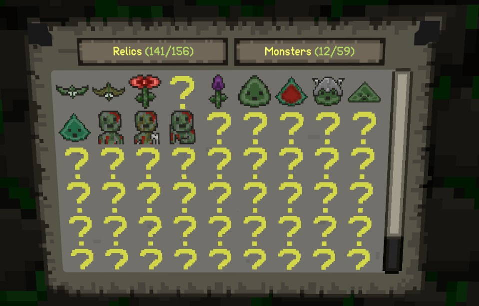
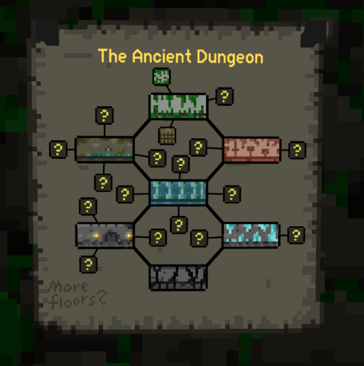
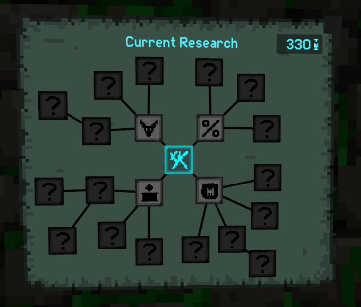
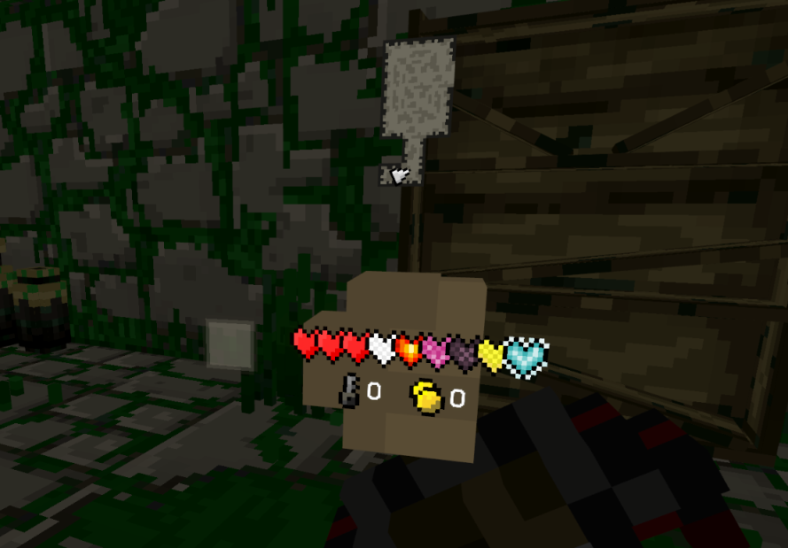
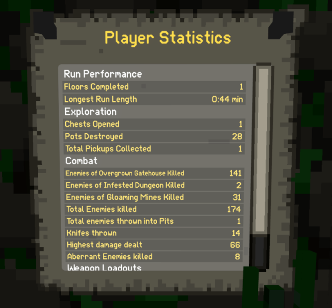

## ⛓️ Ancient Dungeon - New Update! ⛓️

Adventurers, a <b>brand-new update</b> has arrived! This update introduces new enemies, relics, insight upgrades, a Bestiary to track all dungeon creatures, player statistics, and more! Plus, major quality-of-life improvements, bug fixes, and <b>autosaving!</b>

The update is live on Quest and Steam, and coming to PSVR2 next week!

### Read on for the full details:

- <b>Added 3 new enemies</b>
- <b>Added Bestiary</b> – Track all <b>71 enemies</b> you've encountered throughout the dungeon. 

- <b>Added 10 Points of Interest</b> – Unique dungeon areas for more exploration variety <i>(this is just the beginning!)</i>  

- <b>Added 6 new milestones</b> to challenge your dungeon runs.
- <b>Added locked loot rooms</b> to <b>Noxious Sewers</b> and <b>Luminous Depths</b>.
- <b>Added 11 new relics</b> to enhance build variety.
- <b>Added 2 new final boss rooms</b> for more endgame variety.
- <b>Added 1 new orb</b>.
- <b>Added 10 new Insight Upgrades</b> to refine progression.  

- <b>Added 7 new food types</b> <i>(including CHEESE! 🧀)</i>
- <b>Added 5 new Ethereal Heart types</b>.  

- <b>Added Player Statistics Screen</b> – Track dungeon runs, kills, loot collected, and more.  

  

- <b>Autosaving added!</b> The game now autosaves when entering a new floor <i>(just like pressing the save disk).</i>
- <b>Glittering Orb now turns slimes into golden slimes, chests into golden chests, and pots into golden pots.</b>
- <b>Updated Photon Multiplayer version</b> for better online stability.
- <b>Updated Render Pipeline version</b>.
- <b>Reworked dungeon generation logic</b> to prevent objects like crates from spawning inside walls.
  

- Fixed <b>visual glitch</b> with the number of adventurers shown on the <b>Game Over</b> screen.
- Fixed <b>extra insight calculation</b> from <b>Hard Mode</b> not displaying correctly.
- Fixed <b>Gambler’s Delve</b> not awarding relics properly in some cases.
- Fixed <b>other players’ crossbow bolts</b> not making sounds in multiplayer.
- Fixed <b>alternate floors appearing as unlocked</b> on the world map before being discovered.
- Fixed <b>Possessed Skulls respawning incorrectly</b> when killed.
- Fixed <b>exploit allowing modded players to join unmodded lobbies</b>.
- Fixed <b>bosses not spawning</b> in their rooms in singleplayer.
- Fixed <b>Hammertime not unlocking correctly</b> in certain cases.
- Fixed <b>Overstuffed achievement</b> so it now carries over between saves.
- Fixed <b>trigger spam issue</b> in the introduction text screen.
- Fixed <b>Mod Settings menu issues</b>.
  

Have fun diving in and let us know what you think!  

