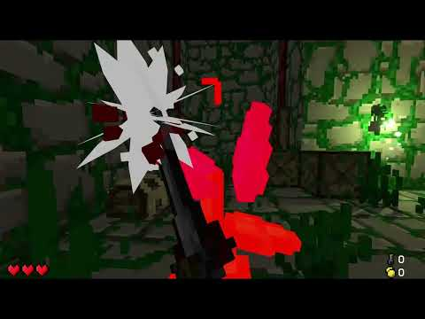
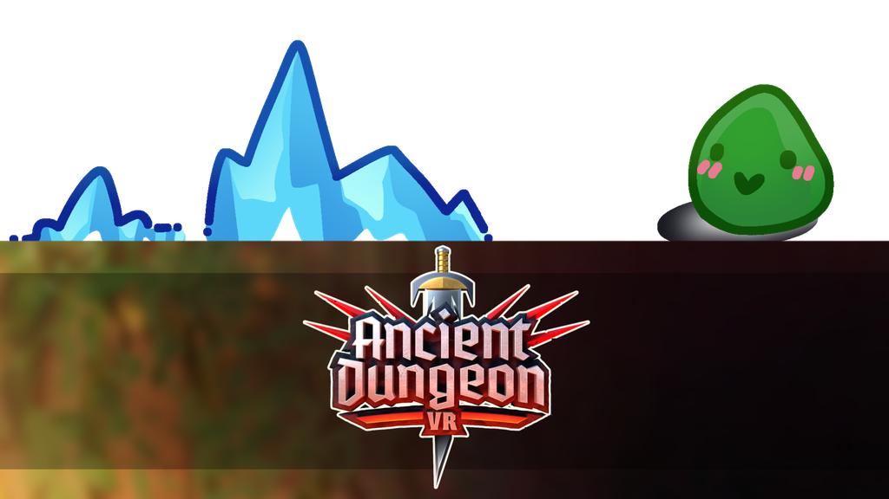

## 🍌 Ancient Dungeon – Monkey Mode Movement Update 🍌
  

Adventurers… we may have gone bananas.

Starting today, you’ll find a brand new movement option in your settings menu:  

<b>Monkey-Style Locomotion</b> 🐒

- <b>Swing through the dungeon like a true Ape</b>
- <b>Use your hands to launch, climb, and swing Gorilla-style</b>
- <b>Totally not how you would imagine exploring dungeons. Surprisingly effective.</b>

To activate it:  
<b>Settings → Movement Options → Monke-Style Locomotion</b>

This experimental feature is available for a <i>limited time only</i>! So if you’ve ever dreamed of throwing yourself through the dungeon with pure upper-body strength, now’s your chance.

<i>Watch the chaos unfold.</i>

<b>Let us know:</b> Is this the next step in dungeon exploration for Ancient Dungeon? Or just us losing our grip (on reality)?

Happy April 1st. Probably. 👀

