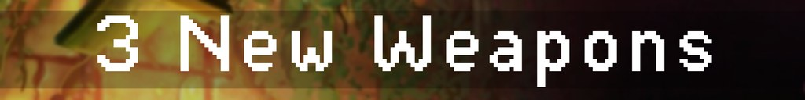
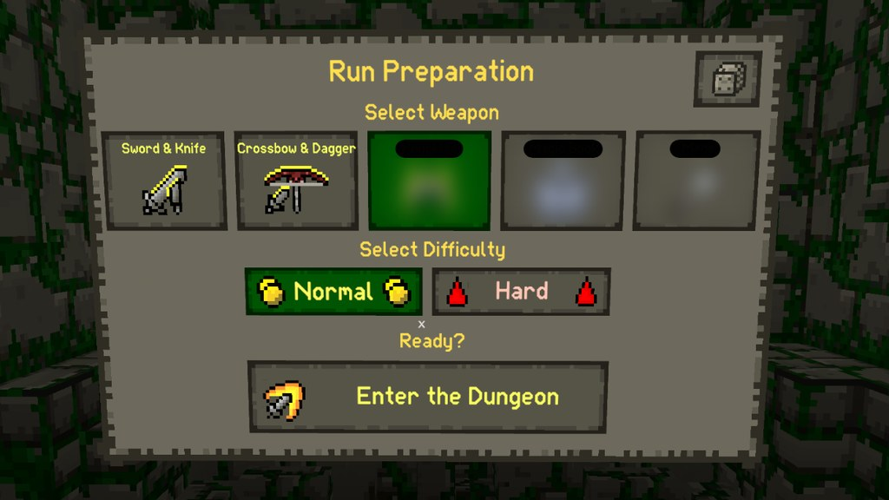
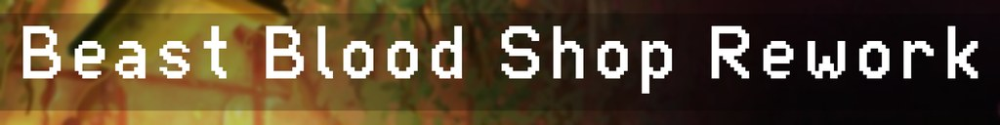
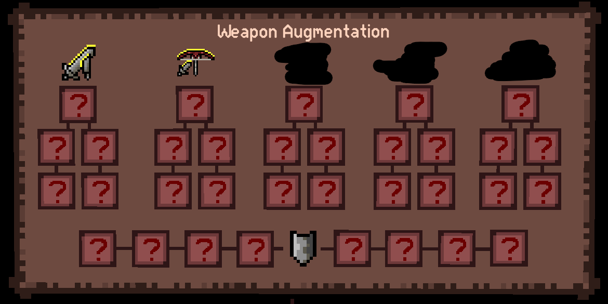
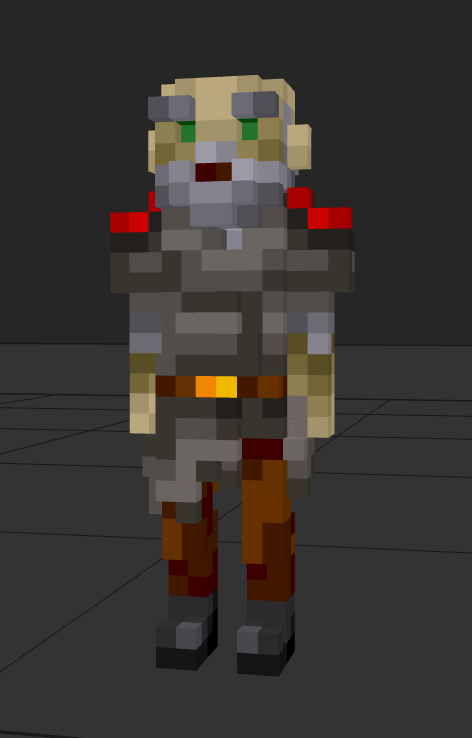

## Hello adventurers!

We bring you a fresh devlog to let you know what we've been hammering away behind the scenes (literally) while you've been clearing dungeons, braving the new alternate floors, and exploring all the new features from the last update. Let's dive into what's coming to Ancient Dungeon.

we couldn't settle on just one so we've been working internally on 3 weapon combos. We'll be releasing them across three separate updates over the next 3 months, with the first coming soon! But here's the fun part: <b>You'll decide which one comes first through this community poll. (https://forms.gle/27RCzVaktPuZ4dAB9)</b> Each combo will offer a new playstyle. 

We'll have more to show soon, but for now, get ready to vote and let us know which one you want first! (https://forms.gle/27RCzVaktPuZ4dAB9)

We're giving the Beast Blood shop a full makeover. With the addition of new weapons, we want to make spending Beast Blood more rewarding. The reworked shop will feel more like the Insight upgrade system, with a clearer layout and more meaningful choices.

It won’t just be about weapons either, expect <b>general character upgrade</b>s too. We heard your feedback and we’re making Beast Blood feel a lot more valuable.

Destruction is about to feel a lot more... destructive. We’re adding visual destruction to dungeon elements like walls, ceilings, pillars, and floors. 

While this won’t turn Ancient Dungeon into a dig-your-way-out sandbox, it opens up exciting new design paths that we're actively exploring like:

- Secrets hidden behind destructible walls
- Secret rooms revealed by throwing explosive orbs
- Doors that can be blasted open with explosions or fire

We want every impact to feel satisfying and who doesn’t want to break more stuff?

Our modding community has been asking for more support, and we're making your lives easier. Coming alongside the next update:

- An updated Room Modder
- A Visual Studio Code Extension
- Full autocomplete, syntax highlighting, and error checking for mod development

This is a full quality of life patch for our fellow modders.

More floors are coming. We're currently working on three new dungeon floors:

- A castle courtyard style alt floor for the Overgrown Gatehouse (first floor)
- A new Library Alt floor
- A floor after the Beast's Cradle with new dangers, tougher enemies, and final lore pieces (we'll share more soon)

Our goal is that every dungeon gets an alternate path and a few surprises beyond that.

We're tweaking the flow of how you unlock content. Here's what's coming:

- Weapon unlocks will require discovery in Points of Interest (these will not require the POI Insight Upgrade), instead of appearing automatically at the blacksmith.
- Lore pages will be split across base and alt floors (whereas before they weren't any in alt floors), with more chances per run
- We'll be finishing the journal storylines in the deeper dungeon layers

We want progression to feel earned immersive, and more satisfying each run.

We're making some upgrades and general improvements, here's a list below:

- Upgraded to Unity 6 for better performance, stability, and bug fixes (including that stubborn multiplayer audio bug)
- Major memory usage improvements to keep high NG+ runs stable and crash free
- Kickstarter NPCs will be added as part of a future weapon update

]

That's it for now! First up is the community weapon poll (https://forms.gle/DqzABbcZrEB6NnEY6). You'll decide what comes next so make sure to vote!

As always, thank you for playing, exploring, and having fun with us. More updates (and sneak peeks) are coming soon. Make sure to join our discord for the latest and to chat with us! (https://discord.gg/advr)

Stay sharp,
-The Ancient Dungeon Team

