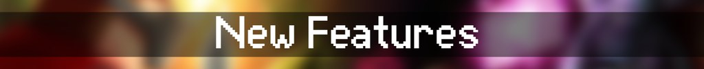
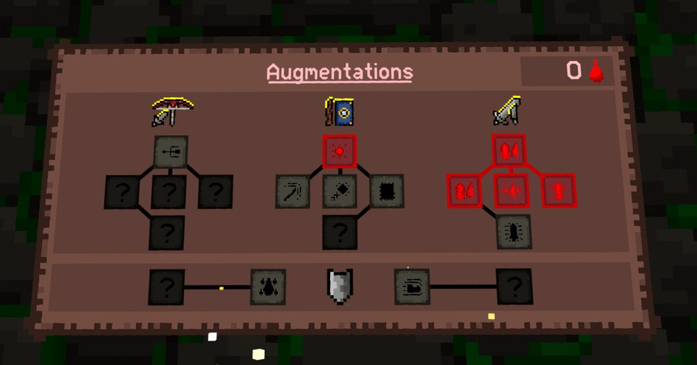
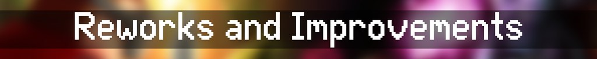
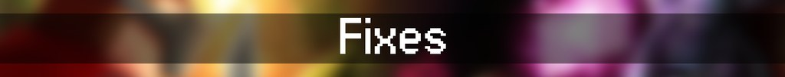

## New weapon, new systems, and major improvements!

Adventurers, it’s time to dive back in the dungeon. This update brings the highly anticipated <b>new magic weapon combo</b>, a reworked Beast Blood shop, massive memory and multiplayer improvements, and new modding tools.

### New Weapon Combo: Wand & Tome

Become a real wizard with this new weapon combo. Wand and Tome has a range of attack capabilities featuring 5 different attacks. 

You have <b>two basic attacks</b> which use basic orbs as fuel. These recharge passively.

The first is your main wand attack. This wand attack is a long range orb blast.

The second basic attack is a book blast. This is a short-range, wide AOE blast done by swinging your book across.

Your tome has various <b>incantations </b>to help you. You can open your book to reveal 3 orbs. 

Each orb represents a different incantation. You can only cast one incantation before you need to recharge your tome by slaying monsters, so use this wisely!

The first orb is a blue orb which features a lightning attack. Zap your enemies away with this powerful lightning spray.

The second orb is a green orb. This lays down a wide poison cloud which damages enemies over time.

The last orb is a red orb, this is a fire blast that does large single enemy damage and burns them for a short period.

### 9 New Beast Blood Upgrades

Customize your build with even more options mix in passive powers and unlock synergies as you go. You will also discover a brand new beast blood shop so head to your home base and take a look!

### 2 New Milestones

### Weapon Unlock Overhaul

Weapons must now be discovered inside the dungeon to be unlocked adding more immersion and a better progression loop. That means you will have to find the new magic weapon at the <b>Forgotten Library!</b>

### New Multiplayer Room Setting: Monke Movement Toggle

Now hosts can allow or disallow monkey movement in rooms. Choose your chaos.

### 🛠️ Modding Overhaul

- Massive rework of modding tools
- New Visual Studio Code Plugin with full auto-complete + syntax/error highlighting
- Improved in-game console with better visuals and features

### Upgraded Audio System

Audio system has been fully upgraded, this comes with fixes to old audio bugs like high NG+ sound issues and orb sound issues.

### Memory Usage and Stability Optimization

Big RAM reductions = fewer crashes in extended runs. We have also done improvements to the stability of dungeon runs. Smoother dungeon crawling ahead.

### Upgrade to Unity 6

We have done a huge upgrade to Unity 6, which should lead to faster updates in the future, and overall improvement in performance.

### Multiplayer Framework Upgrade

Better performance and stability across the board, meaning less crashes during your multiplayer seshes.

### Improved Save System

More robust save data and better handling which should make saving games better overall.

### Settings Menu Upgrade

Settings menu now shows all weapon settings no matter if they're selected or not.

### Weapon Tutorials Added

Each weapon now comes with an in-game tutorial to help you learn fast.

- Fixed Bloodshot Eye killing you unfairly in high NG+
- Fixed stretching grass visual glitch and idle sounds for some enemies
- Fixed audio bugs in high NG+ and orb contractions
- Fixed a rare bug where players could deal negative damage if stats went too high
- Fixed various typos and naming errors

