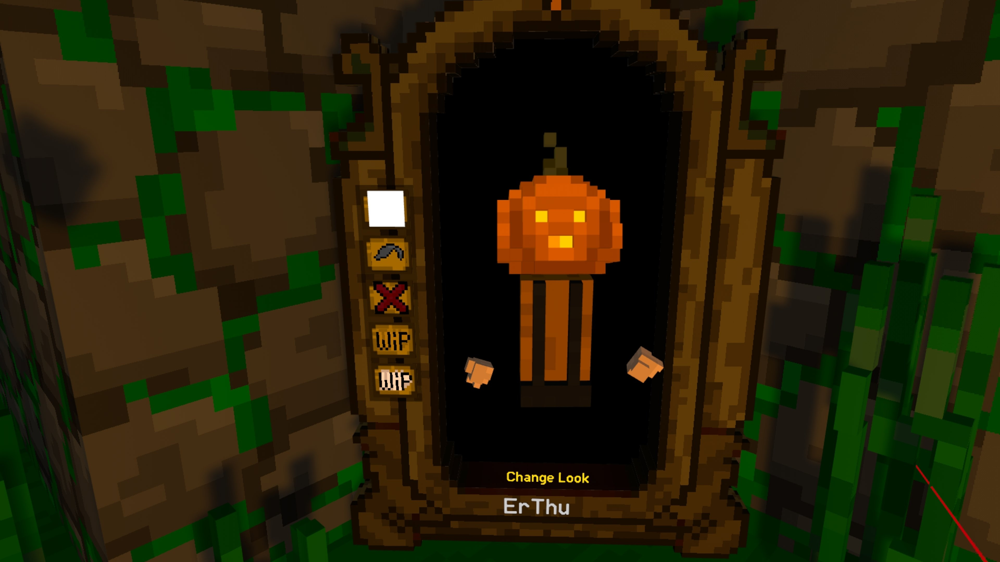
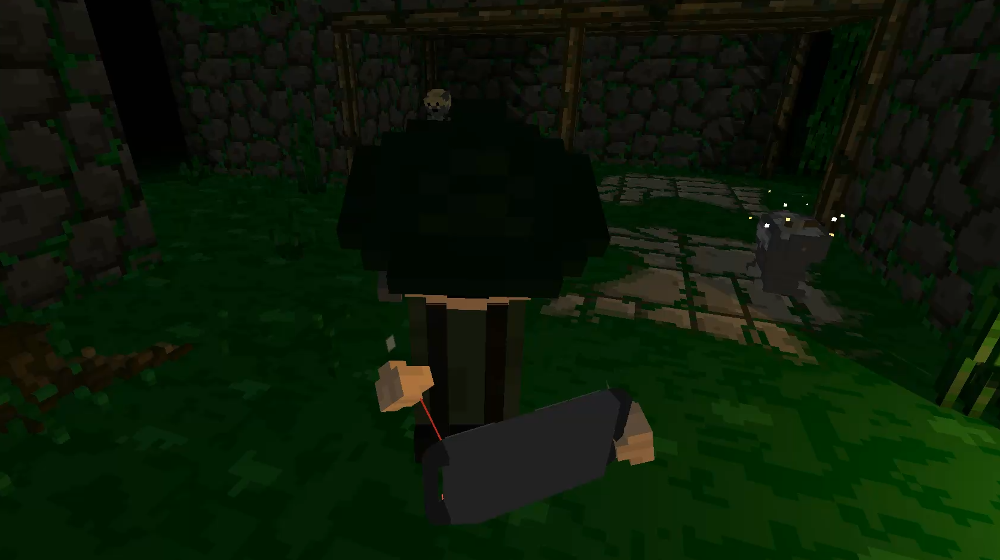
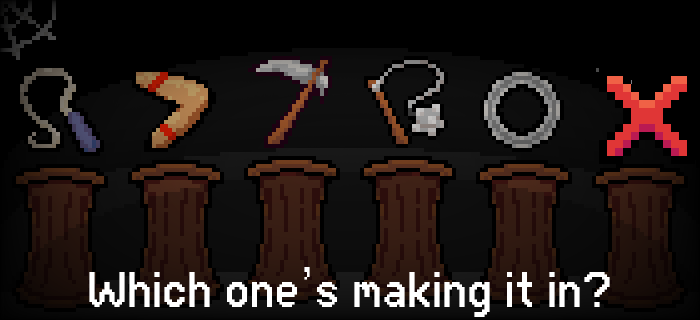
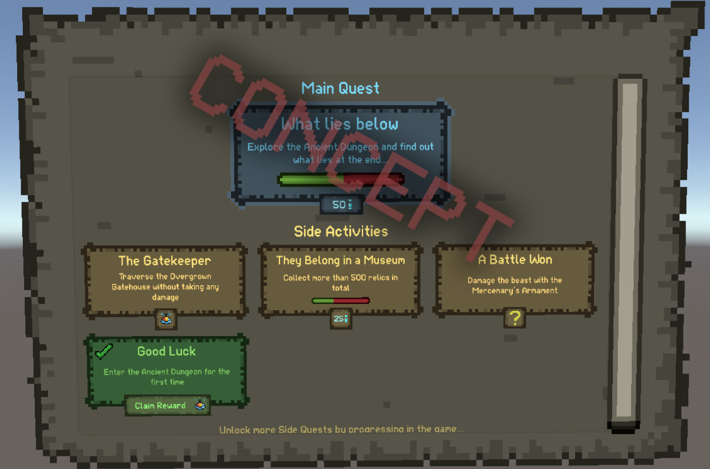

## <color=#DBD700>

Devlog 19 - All Of 2025</color>

<b>Hey Adventurers!</b> We’ve been listening to your feedback and doing a ton of planning, which means we’ve made some changes to our development plans since our last devlog. So, we figured it was time for a new one! This devlog showcases everything included in the <b>Halloween Update</b>, as well as a look ahead at what we’re planning for the<b> rest of 2025</b>.

## This Upcoming Halloween Update

- <b>NEW GAME MODE?!</b> (We’re not telling what it is… yet)
- Tons of new Cosmetics (I hope you're ready) and a place to get dressed and customize yourself!

- Homebase Halloween makeover (including a Photobooth?!)

- Reworks such as fire spreading from one enemy to the other, wisps stacking, and a brand new skeleton death animation

- Special name tags and icons for the varied community programs, moderators, creators, and testers!
- LIV (your personal selfie stick, allows for camera shots and third POV)

- Sealed Rooms return!
- Minimap improvements: this is improvements to the scaling and so that player names appear on the minimap
- Orb to TP back to Merchant, you no longer need to backtrack all the way back to the merchant
- General bug fixes and optimizations

<i>Note: This list covers the main highlights, there are plenty of smaller fixes and improvements like to installing mods included in the update as well that you'll see when the update is released.</i>

## Updates Coming for the rest of 2025

- Cosmetic shop,
- <b>NEW WEAPON</b> coming this December (here's another hint!)

- Christmas fun,
- Multiplayer saving
- Host migration,
- Progression rework
- Milestones reworked into a new Quest System

- Improved shadow quality on Quest 3 and PCVR
- Ongoing bug fixes and polish

<i>These are just the main items planned, we’ll have more to share as development continues.

</i>We also have some team updates! Thom has joined the development team and Kuiq has officially joined the the team as a Community Manager! Beniac \ and Catmaid Kenzie\[Leader of CMR] have joined us from our community moderator program who will be working with Kuiq to help keep our Discord server ("https://discord.gg/advr")safe. 

As always thank you for your support and love! 

Stay spooky, 

-The Ancient Dungeon Team
