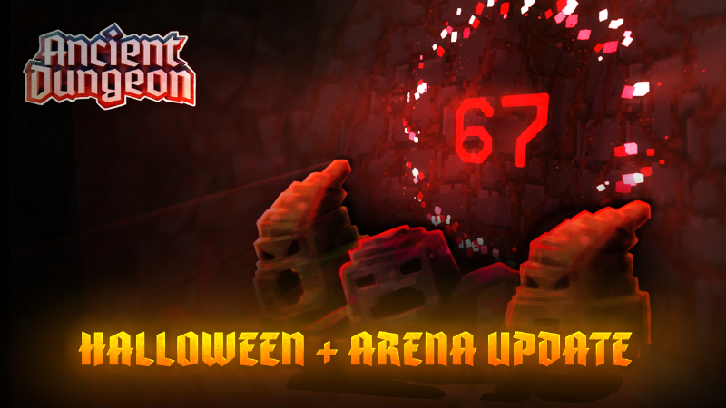
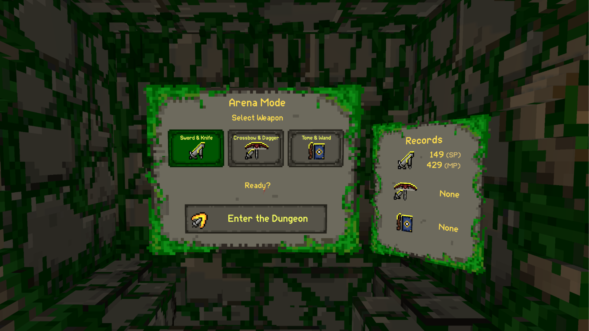
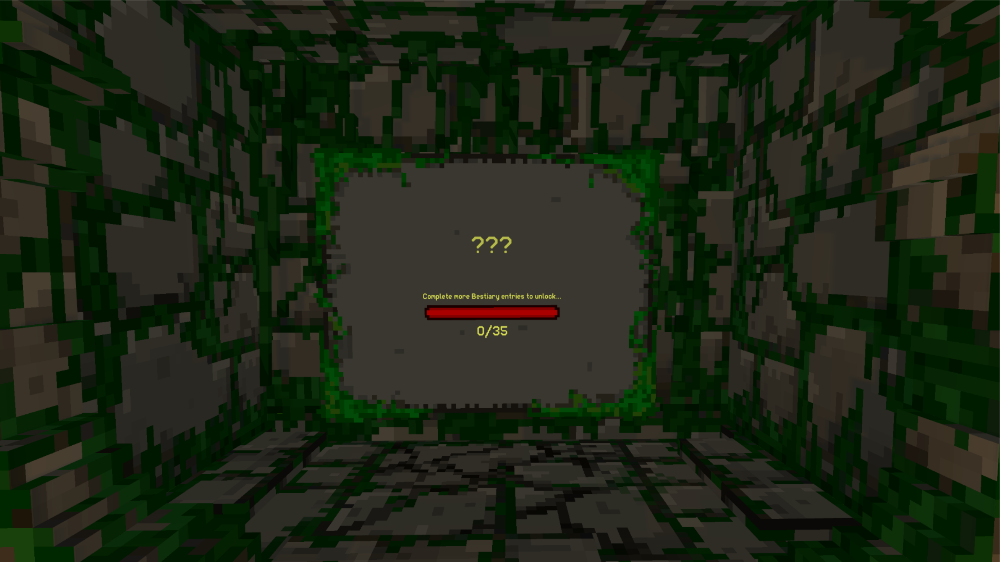
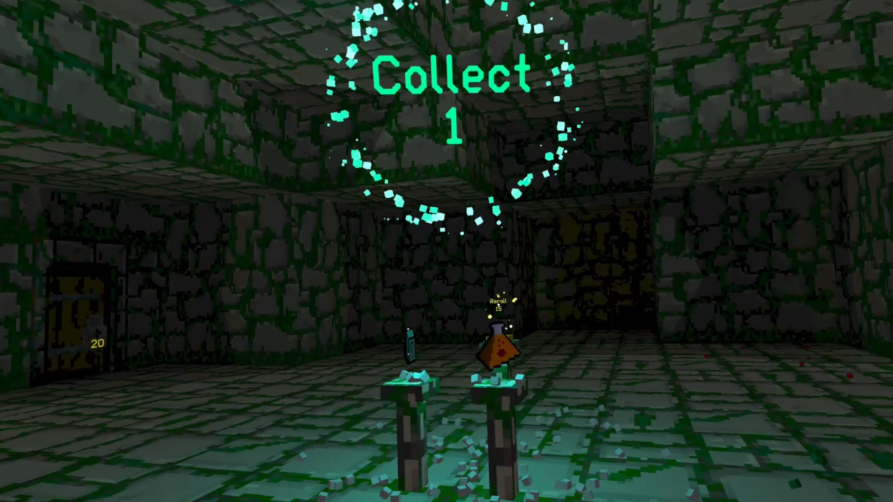
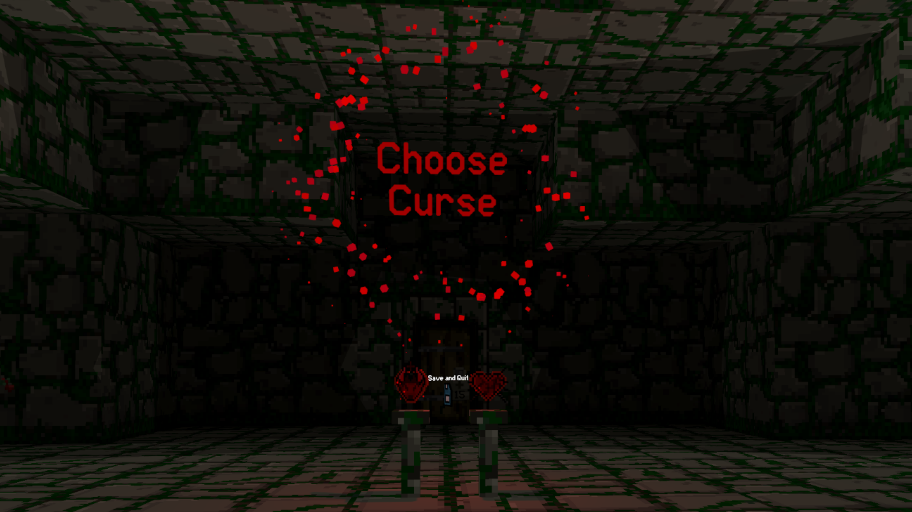
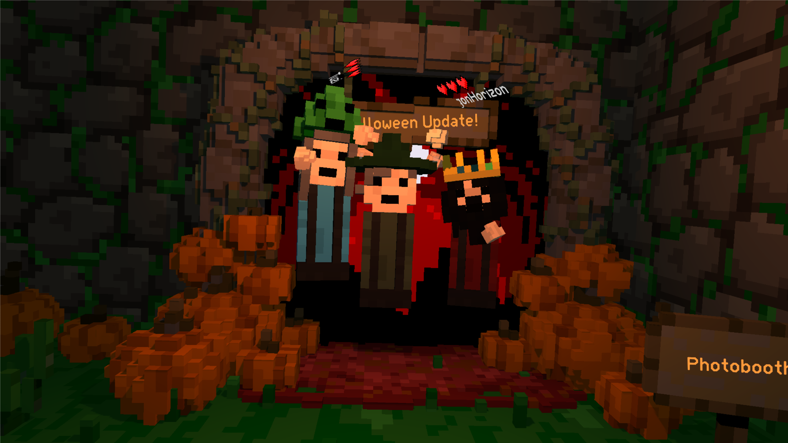
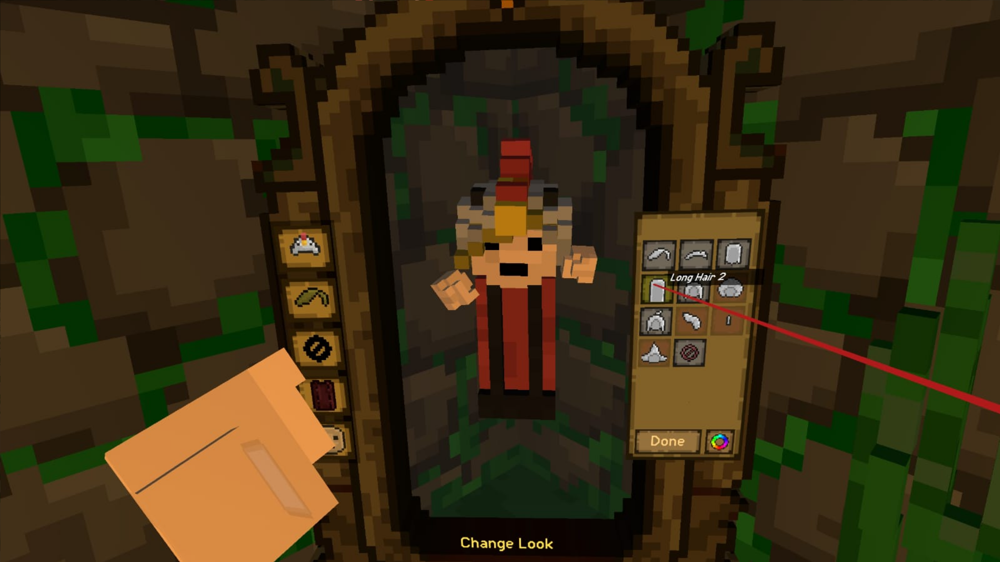

## <color=#DBD700>The Halloween + Arena Update Has Arrived!</color>

Adventurers, it’s time to dive back into the dungeon this Halloween if you dare.

This is one of our <b>biggest and spookiest updates yet</b>, introducing the brand-new <b>Arena Mode</b>: a wave defense mode! Explore the <b>revamped home base</b>, complete with a <b>Mirror to try on new cosmetics</b>, a full <b>Halloween makeover</b>, and even a <b>Photo Booth</b> to capture your frightfully good looks.

We’ve also brewed up a <b>cauldron of reworks, fixes, and treats</b> in this massive update. So without further ado… grab your pumpkin lantern and dive into the sweet (and spooky) details below!

## Arena Mode: New Game Wave-Defense Game Mode

This new game mode can be found next to our classic dungeon crawler mode at the home base. You can hop in with up to 3 other players with all the weapons you have unlocked. Face wave after wave of enemies in the toughest challenge Ancient Dungeon has ever seen. Shorter runs, higher stakes!  

For most it will be unlocked, but if you haven't filled out your bestiary with at least 35 dungeons you'll see a progress bar at the area and it will be locked.  

To unlock it simply hop into the dungeon and discover 35 monsters by going through each floor.

In this new game mode you'll start with just a few monsters spawning. Fight them off and survive the wave and be rewarded with a selection of relics to pick.

After you pick a relic the next wave starts, each wave spawns new relics for you to strengthen yourself and survive so pick carefully! With more players more relics spawn each wave and you're able to select more than 1 relic. 

Occasionally you'll be forced to choose a shared curse! These curses range from waves spawning faster and more chaotic to taking more damage per hits. 

After your selection the floor dynamically changes, this can mean raised platforms, the ceiling crashing down on you, the floor disappearing below you so you have to stay on your feet!

We've also added a ton of traps randomly appearing like this new fire trap besides your classic traps like spikes, darts and more!

Arena mode has 3 doors featuring shops, items, and other goodies for you to unlock. As you kill monsters keys will drop allowing you to unlock these hidden treasures. The doors in this game mode feature a new lock which display how many keys you'll need to unlock them. 

## LIV Implementation: In-Game Camera System

Take pictures and videos from all kinds of angles. Selfies, action shots, and cinematic clips are now just a tap away! Find the toggle for LIV in the MISC in-game settings to spawn the tablet!

## Home Base Updates: Photo booth + Mirror

Find some new additions at the homebase, like a new Halloween themed photo booth to take selfies with your friends!

Find the mirror at the Homebase to change your look. From hats to hairstyles, colors, and all kinds of cosmetics. Unlock more by completing milestones and drip yourself out!

Other changes include:

- Halloween makeover: An assortment of pumpkins (WITH ONE SECRET PUMPKIN SOMEWHERE)
- A button?
- Skeleton head on tree trunk for you to punch around (for good luck)

## Gameplay Changes & Improvements

- Sealed rooms have been added back into the game
- Reworked challenge chest rooms to be more interesting and more difficult in multiplayer
- Burning enemies now ignite nearby enemies
- Wisps now stack; more than 4 merge into stronger, multi-hit versions
- Locked loot rooms now offer better rewards
- Relics not yet found now show a small icon on the top right when you find them in-game
- Abberrants and Bosses now have small indicators in the bestiary
- Changed the probability system of orbs and relics into a weight-based system
- Reworked climbing, if a climbable object moves, players move with it
- Two new milestones added
- Minimap now shows player names in multiplayer

## Performance & Visual Updates

All optimizations, quality-of-life, and graphics-related changes:

- You can actually see your body when looking down (toggled in settings)
- Increased view distance on Quest 2
- Improved audio system: handles overlapping sounds more efficiently
- Increased text scroll speed when pressing trigger
- Relics in home base UI are now correctly sorted by name
- Mods are now installed as .zip files for easier modding
- Improved world generator stability, especially in multiplayer
- Fixed wrong minimap scaling
- Skeletons now bone-splode on death

## Bug Fixes & Polish

- Fixed fly hive performance issues
- Fixed smorgasbord augment and other item-related bugs
- Fixed rotating Beast beam particle issue
- Fixed player collider height in seated mode
- Fixed feed the friend achievement
- Fixed statistics UI time formatting
- Fixed credits names and Craven speech bubble
- Fixed statistics and milestones not updating correctly in multiplayer
- Fixed rotten plant projectile sounds
- Fixed runs not starting after unlocking a new weapon
- Potion effects now flash faster before running out
- Fixed cascading power augment not working correctly
- Fixed enemy network sync issues in multiplayer
- Tons of smaller fixes and optimizations to make runs smoother

That's all for now, adventurers, jump in, try the new Arena game mode, and let us know what you think in the comments!

