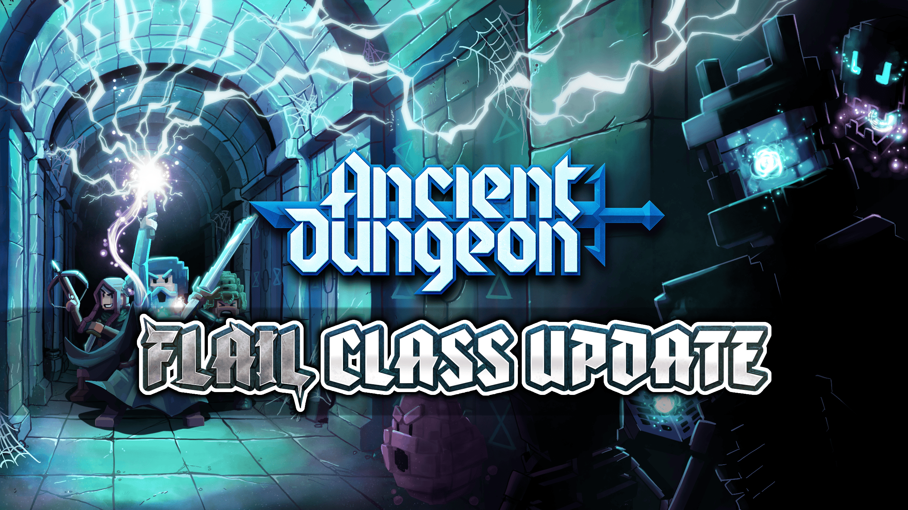

Hello hello, fearless adventurers!

Stretch those arms and secure Clarence to your head, you’re about to flail wildly into the newest update to Ancient Dungeon. And yes, that is both a warning and a promise.

This one’s a big’un. A huge one. The kind of update that kicks the dungeon doors open and tracks cinnamon smelling fungus in your homebase. We’re talking a brand new weapon, awesome revamps, shiny new features, bug fixes that have been bonked into submission, and a pile of quality of life changes stacked taller than a mimic pretending to be a bookshelf (no worries, we totally did not turn bookshelves into mimics in this update).

So without further suspense....

Let’s crack open the update scroll and see what awaits you in the dungeon today.

## <color=#DBD700>NEW WEAPON: Flail and Bomb</color>

The Flail is a heavy weapon ruled by momentum, physics, and the ancient art of swing first, ask questions never. You’ll be whipping a massive iron ball through the air and into anything unlucky enough to exist in front of you. Walls? Bonked. Pesky Flies? Bonked. Personal space (hopefully not the merchant)? Also bonked.

And when swinging wildly isn’t enough, the flail has a trick up its spiked sleeve. Its ranged counterpart is the <b>BOMB</b>. The flail head detaches and becomes a throwable explosive you can launch with your off-hand, detonating on trigger after release. Perfect for clearing mobs, controlling space, or finally getting revenge on those flies that think dodging is a personality trait.

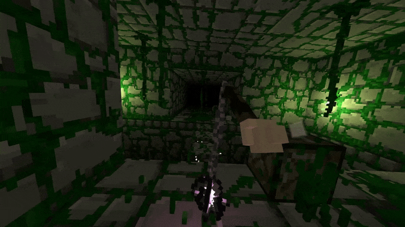

For adventurers who prefer their destruction more… direct: the Flail can retract. This tightens the chain for better control and turns it into a close range monster smacker for when you just want to stand your ground and hit something extremely hard.

Swing big. Throw bigger. Regret nothing.

## How to Find the Flail and other Weapons

Weapons no longer politely appear fully assembled like gifts with a bow on top. No, no. That would be too easy.

Weapons now come in pieces, literally.

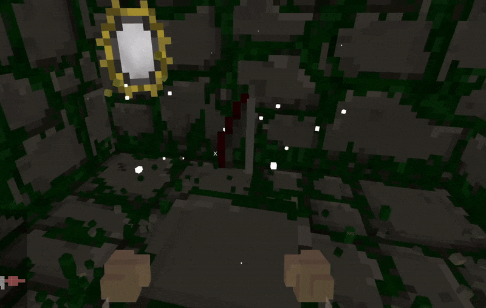

Instead of finding a full weapon in one go, you’ll discover weapon parts scattered through the dungeon and assemble them across multiple runs. The Flail’s parts can be found in the Infested Dungeon and the Mines, so expect a bit of hunting before this beast is complete.

Other weapons now follow this system too.

## <color=#DBD700>2 New Currencies to Bring Home</color>

Two new currencies have appeared in the dungeon, and yes, you’re expected to bring them home like a responsible adventurer.

You can now return Gold and collect Crystals during your runs and bring them back to the homebase. Apparently the Acolyte discovered there’s treasure down there and immediately declared a mandatory (optional) donation to the Grand Library. Very noble. Very suspicious.

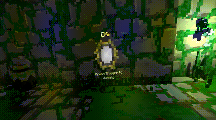

After boss fights you’ll find his loyal assistant: the Scrying Glass. Deposit your gold and crystals into it for safekeeping, and they’ll be waiting for you back home.

Crystals unlock Augment slots (what augment slots? patience, hero), while gold fuels various upgrades with more uses coming in future updates. The dungeon economy is thriving. Please invest responsibly.

## <color=#DBD700>Equipment Augments ENTIRELY Reworked</color>

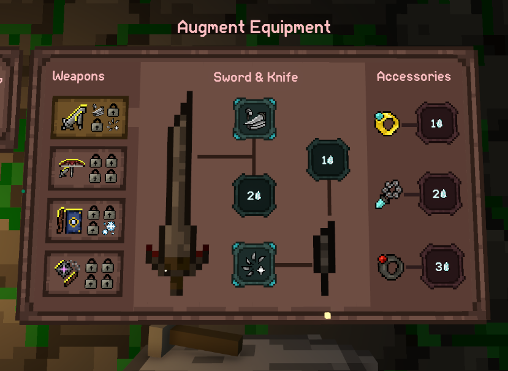

Augments have been completely reforged.

The old upgrade tree has been retired to a quiet farm upstate. Augments are now slots you equip into your loadout, meaning you’ll have to choose what powers you bring into battle instead of unlocking everything forever. Buildcrafting is now a thing. A dangerous, wonderful thing.

We’ve added 20 new augments so you can twist your playstyle into something truly unrecognizable. And this system lays the groundwork for future SPECIAL augments coming in later updates.

Head to the anvil, experiment, and prepare your loadout like a proper dungeon professional. The monsters will not adjust accordingly.

## <color=#DBD700>Quest System</color>

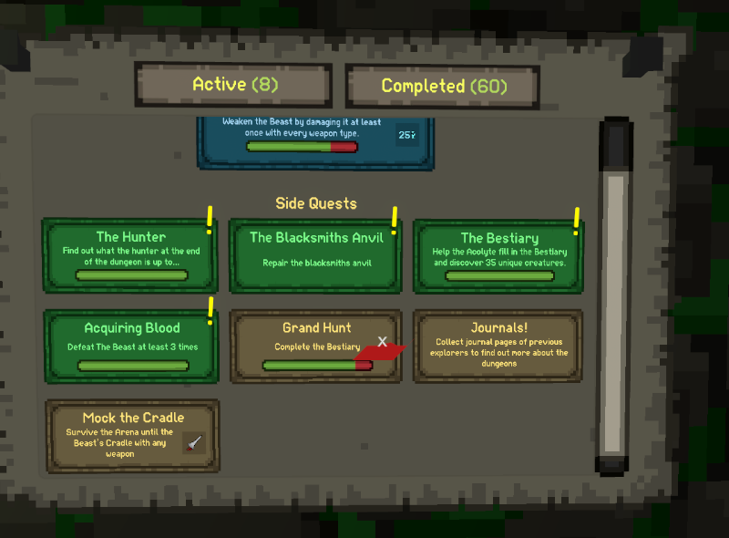

Every hero needs a quest. Preferably several. Preferably posted anonymously on a board somewhere.

Milestones have been reborn as a full Quest Board. Head to where milestones used to live and you’ll now find active quests ready to be tackled and rewards ready to be claimed. As you push through the story and conquer new challenges, more quests will appear.

The dungeon now officially recognizes your heroism in writing. No backing out now.

Happy questing, adventurers!

## <color=#DBD700>A Sketchy Pond?!</color>

The homebase has expanded… and apparently discovered water.

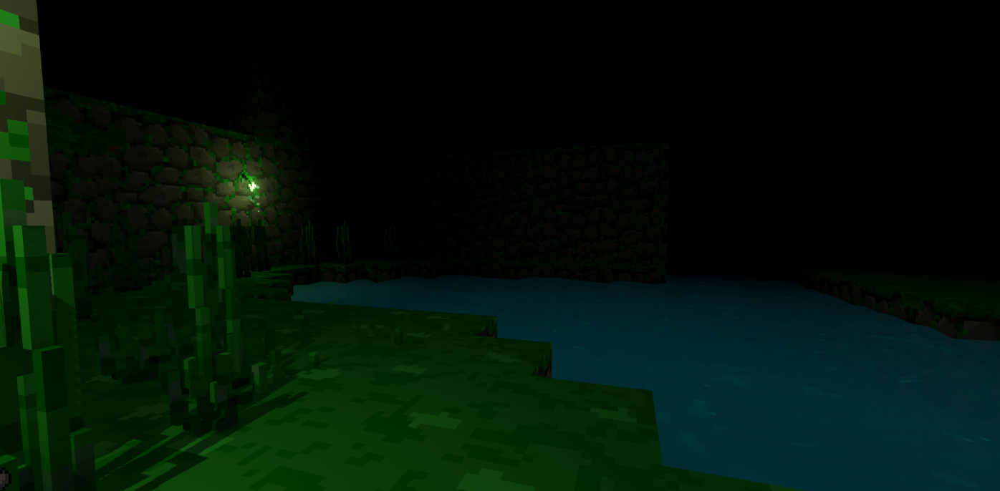

A suspicious little pond has appeared, sitting there quietly and definitely not plotting anything. We’re told it’s important. We’re also told not to ask too many questions. The Acolyte insists this is all part of a grand plan we’ll “understand later.”

We don’t trust it. You probably shouldn’t either.

But it is very scenic. Just a reminder, you definitely do not know how to swim. 

Talking about scenic, get ready for...

## <color=#DBD700>Infested Dungeon REDESIGNED</color>

That's right, the Infested Dungeon has been completely redesigned and now looks disgustingly beautiful.

New visuals, new atmosphere, same unsettling cinnamon smell wafting through the air. If you’re allergic, please consult your healer and bring an epipen. The dungeon is not liable for spice-related incidents.

Enjoy the view. Try not to breathe too deeply.

## <color=#DBD700>KICKSTARTER NPCS!</color>

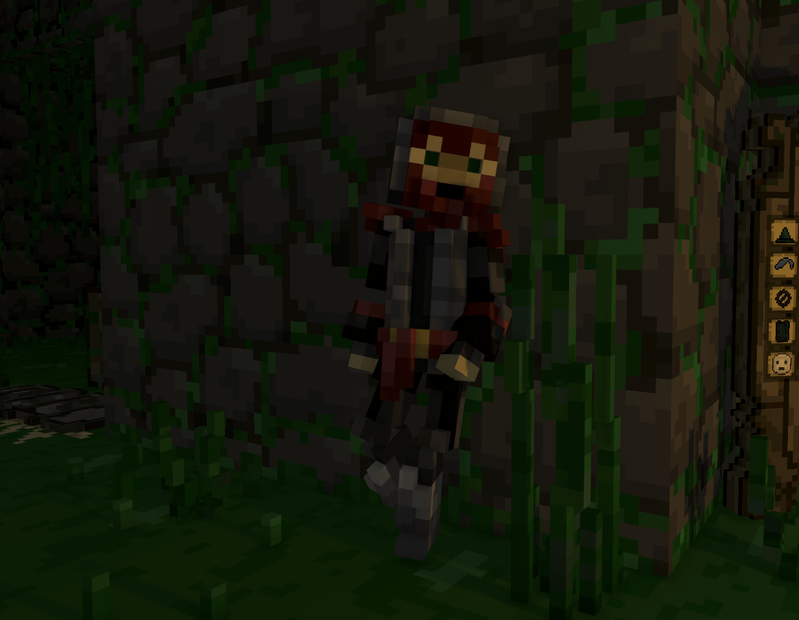

Four Kickstarter NPCs have moved into Ancient Dungeon and now occasionally visit your homebase to chat, loiter, and generally exist in a way that feels important.

If you grow attached (or just enjoy the company), you can permanently enable them in the settings menu so they stick around. The dungeon is dangerous it’s nice to have roommates.

AND... ONE OF THEM IS A CAT?!

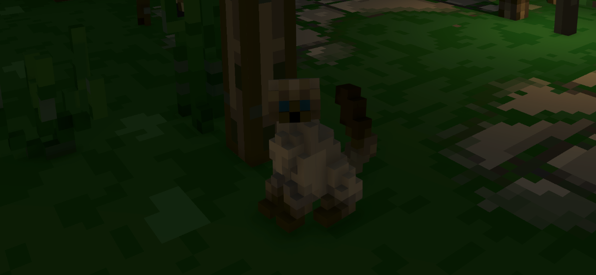

## <color=#DBD700>SAVE SLOTS</color>

We've added save slots! You can now have up to 3 different save files in the game and switch between them in the main menu.

## <color=#DBD700>Arena Changes</color>

We've added a lot more Arena Mode Room variations and made infested/noxious and mines/depths appear randomly and not one after another.

## <color=#DBD700>NEW END SCREEN</color>

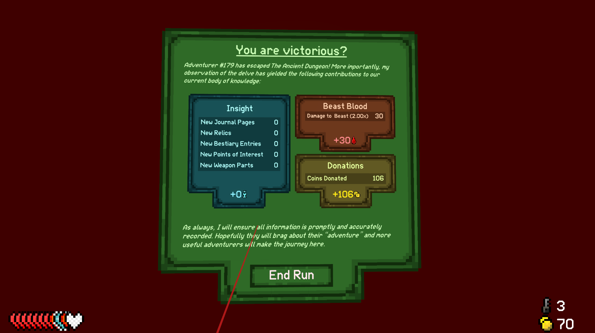

You'll find a new end screen after you die in the dungeon, giving you a more detailed breakdown of your journey.

## <color=#DBD700>Reworked Fog and added Ambient Occlusion</color>

<i>BEFORE</i>

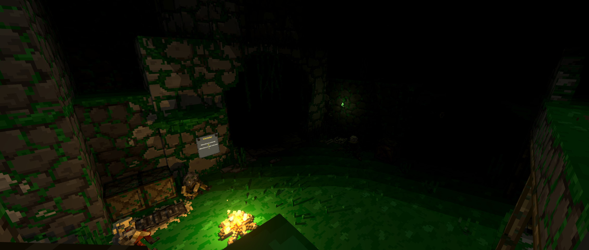

<i>AFTER</i>

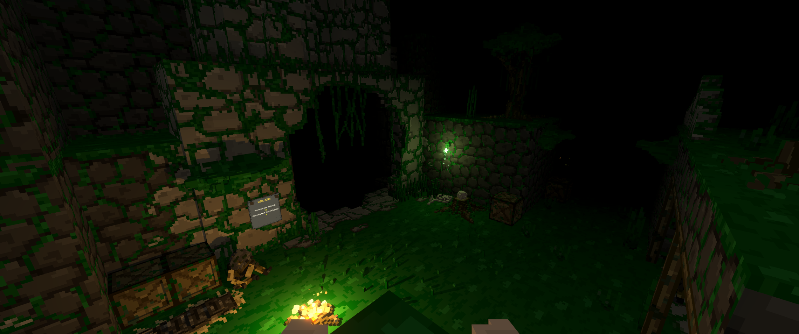

As you can see we've made huge improvements in how the fog looks in the game. The dungeon and your homebase is now prettier. You welcome.

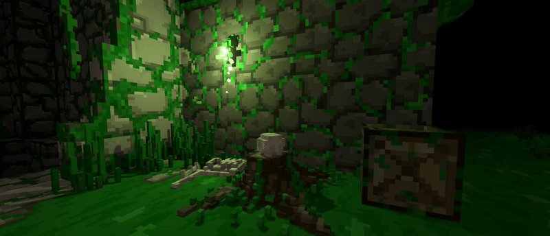

We've added Ambient Occlusion! There's a setting to turn it on now, so your dungeon is EVEN prettier.

## <color=#DBD700>Insight and Lore Reworks</color>

We have completely reworked how Insight is calculated. You now can't collect infinite Insight anymore. Insight is now based on your game progression (bestiary entries, relics found, journal pages etc).

We have also reworked the way journal pages spawn in the dungeon to unlock them faster and more reliably, especially for experienced players.

## <color=#DBD700>Changes and Adjustments</color>

- Added a new stat called Mortality, which shows how much damage you will receive when hit
- Stats of other players can now be seen in multiplayer
- added multiple small new dialogues to the acolyte and blacksmith npc
- Soul Delves now give more insight (and award crystals) and will show the amount on the UI (if not completed)
- All drop tables are now affected by luck, which means chests, enemies etc will drop less or more depending on your luck stat
- If you have a mark equipped you will now see it visually recharge when killing an enemy
- Added a few new insight upgrades related to early game progression
- Lowered difficulty of Noxious Sewers and Luminous Depths to be more in line with the base floors
- Dungeons now use a new seed system to make them 100% consistent to that specific seed
- Weapons can now be unlocked by finding multiple weapon parts within the dungeon instead of the whole weapon at once
- the game now awards 5 beast blood on beast kill. Hard mode increases the awarded blood amount by the multiplier. First phase of beast awards 1, second phase 1 as well and third phase 3.
- added a crit damage stat (hidden in ui for now), that changes how much crit damage you will do
- added ghost of ghost fights to bestiary
- added lore rooms for luminous depths and noxious sewers
- removed ginseng root relic

## <color=#DBD700>FIXES & IMPROVEMENTS</color>

- Massively increased the loading speed of the game
- Dying in Singleplayer will not reload the game anymore and will immediately respawn you at the home base (like in multiplayer)
- You can now control the voice chat volume of each player separately
- Alt floors will now appear from the start and don't need to be unlocked
- you can now see which player has not bought or bought an insight upgrade by hovering over the lock in the UI
- fixed an issue in the world generator which caused rooms to always spawn in the same orientation
- fixed lots of z fighting issues in the game
- fixed multiple generation desync issues in multiplayer
- updated LIV sdk to latest version
- fixed fire or poison effects not spawning a visual if effects are applied quickly after the previous one has run out
- fixed cosmetics shop ui rendering above stat screen ui
- fixed modding coroutines not correctly cleaning up
- fixed ghosts not dissapearing after a fight
- fixed player models having bald spots
- lots of performance improvements in the gloaming mines, which should remove the lag many people were experiencing
- fixed duplicate hit splashes appearing when hitting enemies in some cases
- fixed lots of visible MSAA seams
- fixed wasp nest state not persisting when saving
- fixed some issues with the queen fly
- fixed granitle pestle working for other players
- fixed arena pool running out of relics and causing softlocks
- fixed onButtonPress modding event not working in multiplayer
- fixed insight board not updating when a player leaves
- your wrist info will now be hidden in the home base
- increased maximum allowed deadzone in settings to 0.9
- improved visible body setting visibility
- fixed magic wand not being able to cut grass
- fixed minecart not working for tome and wand combo
- rebalanced some insight upgrade costs
- fixed some softlocks with the rabid bestiary
- updated some colliders on elementals to make them more reliable with crossbow
- multiple fixes to the ingame console
- and MANY MORE...I don't want to bore you guys

