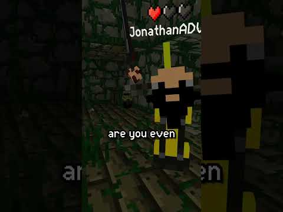
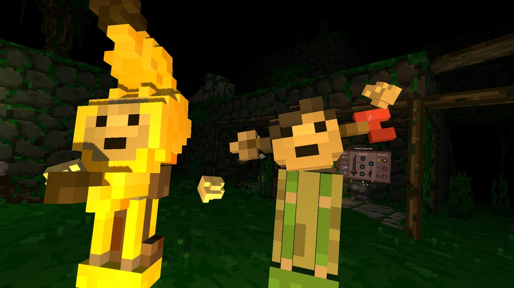
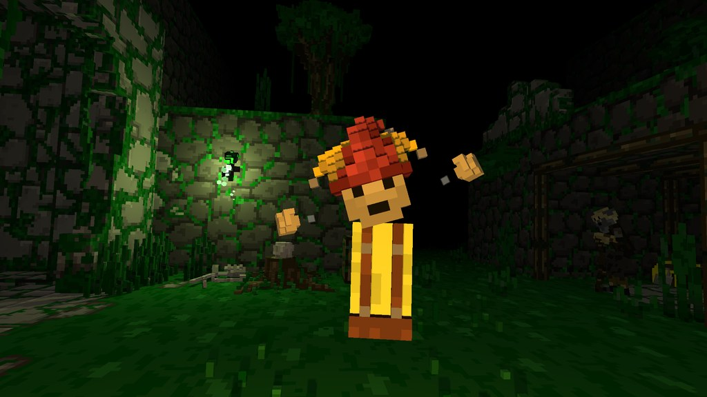

## April Fools Update is Live!

Adventurers! We got a fresh update rolling out with some long-awaited improvements, new cosmteics, and a few surprises along the way for tomorrow... 

## Something strange...

We've been hearing...odd things echoing through the dungeon lately. Might be nothing. Might be worth checking in on April first and going in the dungeon. 

Sneak peek:

## Cosmetics

Your dungeon cosmetics just got an upgrade. 

- More cosmetics can now be fully colored
- Certain pieces (like torsos) now uspport multiple color regions
- Improved hair handling across different hat types (The Grand Library has discovered hair spray)

 NEW COSMETICS 

- Arrow through the head (shot by Eric)
- Banana Hat
- Jester Hat
- Slim Torso
- Wide Eyes Face

## Fixes And Improvements

- Fixed multiple issues with UI pointers
- Fixed network desyncs in multiplayer
- Fixed tutorial hint being inverted for new players
- Fixed item buy areas sinking into the ground
- Fixed total game progress not reaching 100% correctly
- Fixed skeletons occasionally canceling their jump animation
- Fixed an issue with some quests not appearing properly on the quest board
- Improved multiplayer error messages
- Fixed player nametag height being affected by cosmetics
- Added Modding support <i>onPlayerServerInfoLoaded</i> event and* onGameInitialized* Event

Enjoy the new cosmetics and fixes live now, and make sure to log in and play tomorrow!
