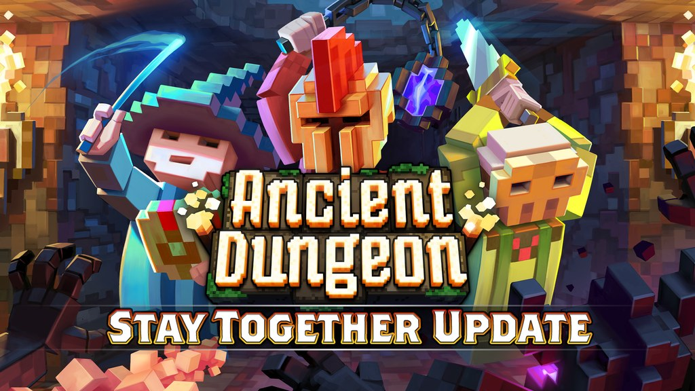
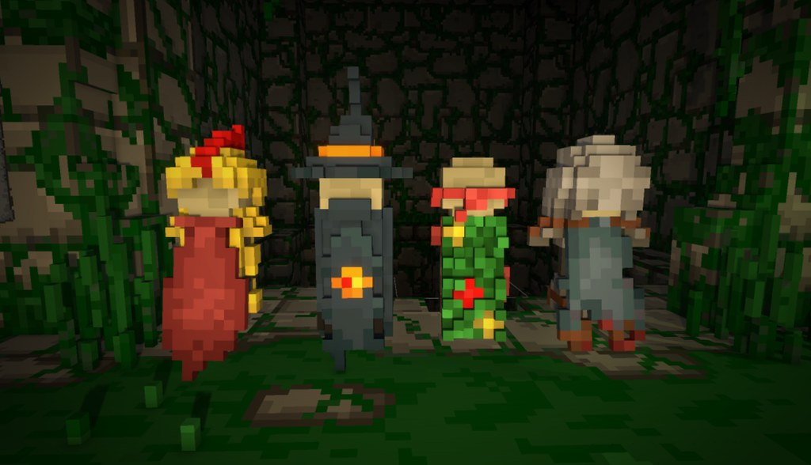
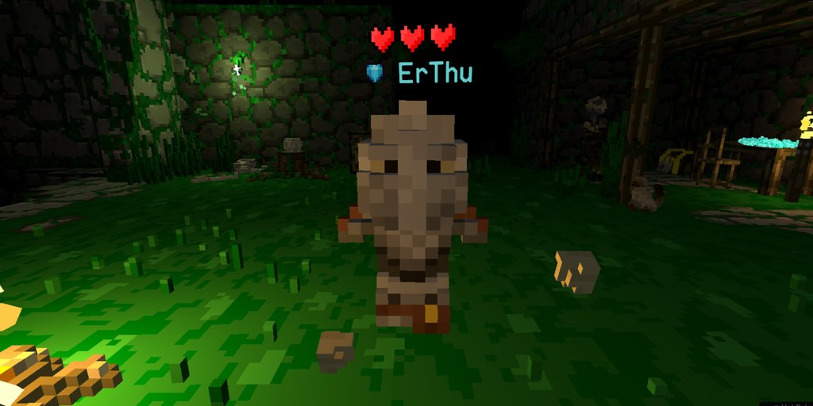

Adventurers,

Some long requested changes have finally made their way through the dungeon… along with a few new surprises.

## What's New?
### Multiplayer Saving

Multiplayer runs can now be saved just like singleplayer, including autosaves. If something interrupts your run like a low battery, you can continue from your last save point with your fellow adventurers. 
Saved runs also show who you played with and additional run details.Multiplayer runs can only be continued with players from the original group.

### Host Migration
Runs can now continue even if the host leaves. The system uses multiplayer autosaves to recover the session.Note: you’ll be returned to the start of the current floor when this happens.
We also improved host handling in general, so hosts leaving lobbies that haven't started a run will just assign a new host automatically.

### Sealeed Soul Run Saving
Sealed Soul runs can now be saved.

### News UI (Home Base)
A new in game news board has been added, letting you browse updates and devlogs directly from the home base, as well see what we're working on next!

### Ghost Encounters Expanded

Ghosts can now appear even after all have been discovered, occasionally spawning in the dungeon with rewards.

### New Quests
Added 4 new quests.

### New Cosmetic Type: Capes
We have added a new cosmetic slot for capes! They look awesome and react to your movement.

### New Free Cosmetics
- Apprentice Helmet
- Apprentice Chainmail
- Basic Cape
- Old Cape

## Supporter Pack DLC
Includes a set of additional cosmetics for those looking to further customize their adventurer

### Class Sets
- Mercenary Class Set and Mercenary Cape
- Paladin Class Set and Paladin Cape
- Magician’s Class Set and Rabid Bestiary Cape
- Assassin’s Class Set and Overgrown Cape

### Capes
A selection of exclusive capes included in the pack

### Extras
- Gem flair next to your name
- Special name color

This is something we originally planned to wait on until later, but as the dungeon has grown, so has the scope of what we’re building.

The pack is entirely optional and purely cosmetic, it's a way to support development while getting a few extra ways to stand out in your runs.

As always, we’ll continue expanding the dungeon for everyone.

## Improvements and Changes
- Updated relic stat overlay (e.g. Bone Dice, Third Card Monte)

- Reworked Myopic Lens (Myopic Lens is actually good now?!)
- Teleport movement can no longer pass through doors or walls
- Cosmetic system improvements
- Cosmetics now store colors per item instead of per slot
- Improved saved run details (floor, time, etc.)
- Updated main menu and loading screens with new logo
- Sealed rooms now have a distinct minimap color
- You can now press and hold at the scrying glass to donate coins
- Demanding Orb now briefly flashes the screen when applied
- Host player is now clearly indicated in multiplayer menus

### Fixes
- Fixed Ponytail 2 not being colorable
- Fixed multiplayer voice setting inconsistencies
- Fixed quest unlock issues on older saves
- Fixed evasion ignoring negative values
- Fixed Ascetic Delve spawning food
- Fixed Bat Ear not functioning correctly
- Fixed relics being carried out of shops
- Fixed crossbow bolt return timing inconsistencies
- Fixed ceiling crystal spawn issues
- Fixed several ghost encounter issues

### Modding
- Added onPotionEffectStarted event